# IP 协议


## IP地址的基础知识

在用TCP/IP 通信时，用IP地址识别主机和路由器。为了保证正常通信，有必要为每个设备配置正确的IP地址。在互联网通信中，全世界都必须设定正确的IP地址。否则，根本无法实现正常的通信。因此，IP地址就像是 TCP/IP 通信的一块基石。


### IP 地址的定义

IP地址(IPv4地址)由32位正整数来表示。TCP/IP通信要求将这样的IP地址分配给每一个参与通信的主机。IP地址在计算机内部以二进制方式被处理。然而，由于人类社会并不习惯于采用二进制方式，需要采用一种特殊的标记方式。那就是将32位的IP地址以每8位为一组，分成4组，每组以“.”隔开，再将每组数转换为十进制数"。下面举例说明这一方法。

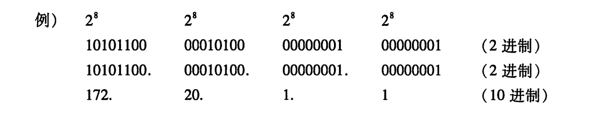


### IP 地址由网络和主机两部分标识组成

IP地址由“网络标识(网络地址)”和“主机标识(主机地址)”两部分组成。

如图4.11所示，网络标识在数据链路的每个段配置不同的值。网络标识必须保证相互连接的每个段的地址不相重复。而相同段内相连的主机必须有相同的网络地址。IP地址的“主机标识”则不允许在同一个网段内重复出现。

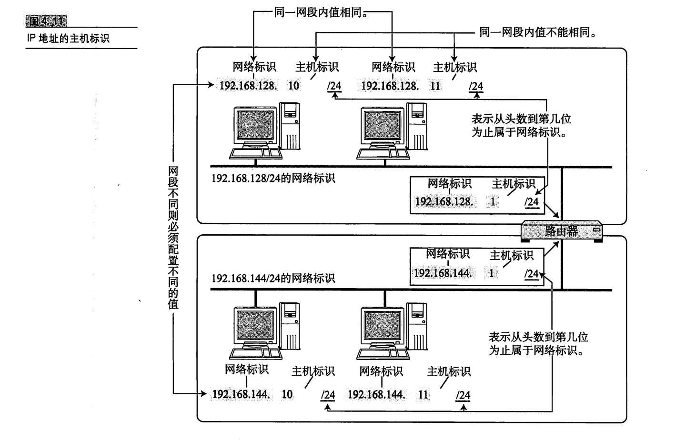


### IP 地址的分类

IP地址分为四个级别，分别为A类、B类、C类、D类。它根据IP地址中从第1位到第4位的比特列对其网络标识和主机标识进行区分。

- A类地址

  A类IP地址是首位以“0”开头的地址。从第1位到第8位是它的网络标识。

  用十进制表示的话，0.0.0.0~127.0.0.0是A类的网络地址。A类地址的后24位相当于主机标识。因此，一个网段内可容纳的主机地址上限为16，777，214个。

- B类地址

  B类IP地址是前两位为“10”的地址。从第1位到第16位是它的网络标识。

  用十进制表示的话，128.0.0.1~191.255.0.0是B类的网络地址。B类地址的后16位相当于主机标识。因此，一个网段内可容纳的主机地址上限为65，534个。

- C类地址

  C类IP地址是前三位为“110”的地址。从第1位到第24位是它的网络标识。

  用十进制表示的话，192.168.0.0~239.255.255.0是C类的网络地址。C类地址的后8位相当于主机标识。因此，一个网段内可容纳的主机地址上限为254 个。

- D类地址

  D类IP地址是前四位为“1110”的地址。从第1位到第32位是它的网络标识。

  用十进制表示的话，224.0.0.0~239.255.255.255是D类的网络地址。D类地址没有主机标识，常被用于多播。

  

### 广播地址

广播地址用于在**同一个链路中相互连接的主机之间发送数据包**。

当主机号全为 1 时，就表示该网络的广播地址。例如把 `172.20.0.0/16` 用二进制表示如下：

```plaintext
10101100.00010100.00000000.00000000
```

将这个地址的**主机部分全部改为 1**，则形成广播地址：

```plaintext
10101100.00010100.11111111.11111111
```

再将这个地址用十进制表示，则为 `172.20.255.255`。


**两种广播**

在本网络内的广播叫做本地广播。例如网络地址为192.168.0.0/24的情况下，广播地址是192.168.0.255。因为这个广播地址的IP包会被路由器屏蔽，所以不会到达 192.168.0.0/24 以外的其他链路上。

在不同网络之间的广播叫做直接广播。例如网络地址为192.168.0.0/24的主机向192.168.1.255/24的目标地址发送IP包。收到这个包的路由器，将数据转发给192.168.1.0/24，从而使得所有192.168.1.1~192.168.1.254 的主机都能收到这个包。

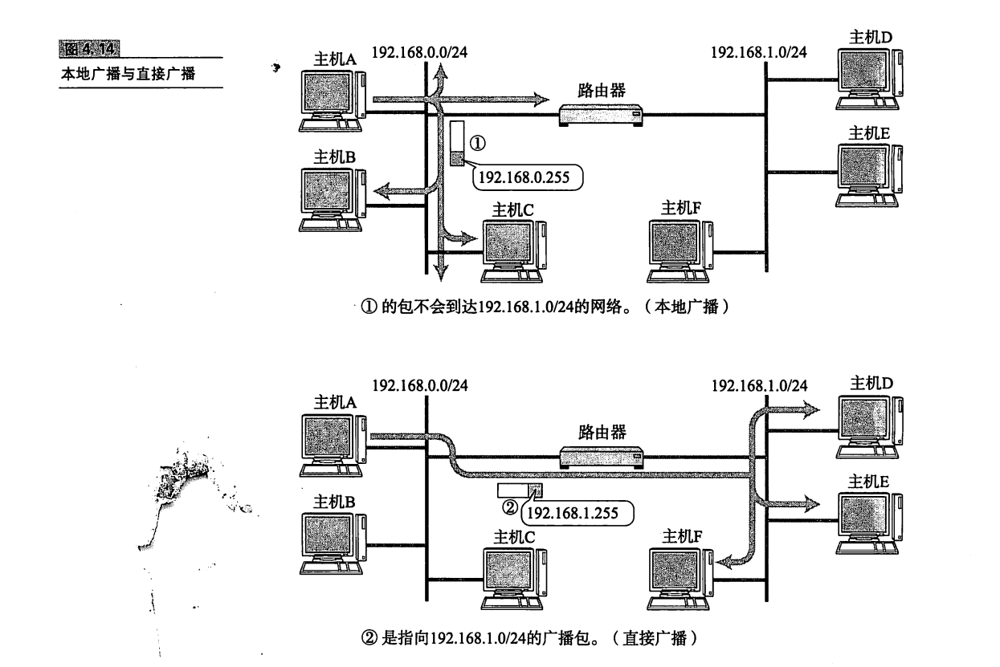


### IP 多播

>同时发送提高效率

多播用于将包发送给特定组内的所有主机。由于其直接使用IP协议，因此也不存在可靠传输。

而随着多媒体应用的发展，对于向多台主机同时发送数据包，在效率上的要求也日益提高。在电视会议系统中对于1对N、N对N通信的需求明显上升。而具体实现上往往采用复制1对1通信的数据，将其同时发送给多个主机的方式。在人们使用多播功能之前，一直采用广播的方式。那时广播将数据发给所有终端主机，再由这些主机IP之上的一层去判断是否有必要接收数据。是则接收，否则丢弃。

然而这种方式会给那些毫无关系的网络或主机带来影响，造成网络上很多不必要的流量。况且由于广播无法穿透路由，若想给其他网段发送同样的包，就不得不采取另一种机制。因此，多播这种既可以穿透路由器，又可以实现只给那些必要的组发送数据包的技术就成为必选之路了。

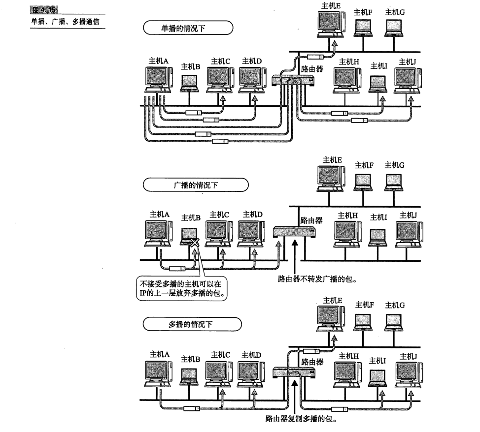


### 子网掩码

>分类造成浪费?

一个IP地址只要确定了其分类，也就确定了它的网络标识和主机标识。例如A类地址前8位(除首位“0”还有7位)、B类地址前16位(除首位“10”还有14位)、C类地址前24位(除首位“110”还有21位)分别是它们各自的网络标识部分。
由此，按照每个分类所表示的网络标识的范围如下所示，


用“1”表示IP网络地址的比特范围，用“0”表示IP主机地址范围。将它们以十进制表示，如下所示。其中“1”的部分是网络地址部分，“0”的部分是主机地址部分。


网络标识相同的计算机必须同属于同一个链路。例如，架构B类IP网络时，理论上一个链路内允许6万5千多台计算机连接。然而，在实际网络架构当中一般不会有在同一个链路上连接6万5千多台计算机的情况。因此，这种网络结构实际上是不存在的。
因此，直接使用A类或B类地址，确实有些浪费。随着互联网的覆盖范围逐渐增大，网络地址会越来越不足以应对需求，直接使用A类、B类、C类地址就更加显得浪费资源。为此，人们已经开始一种新的组合方式以减少这种浪费。


>子网与子网掩码

现在，一个卫地址的网络标识和主机标识已不再受限于该地址的类别，而是由一个叫做“子网掩码”的识别码通过子网网络地址细分出比A类、B类、C类更小粒度的网络。这种方式实际上就是将原来A类、B类C类等分类中的主机地址部分用作子网地址，可以将原网络分为多个物理网络的一种机制。

自从引人了子网以后，一个IP地址就有了两种识别码。一是IP地址本身，另一个是表示网络部的子网掩码。子网掩码用二进制方式表示的话，也是一个32位的数字。它对应IP地址网络标识部分的位全部为“1”，对应IP地址主机标识的部分则全部为“0”。由此，一个IP地址可以不再受限于自己的类别，而是可以用这样的子网掩码自由地定位自己的网络标识长度。当然，子网掩码必须是IP地址的首位开始连续的“1”

>最初提出子网掩码时曾允许出现不连续的子网掩码，但现在基本不允许出现这种情况。

对于子网掩码，目前有两种表示方式。以172.20.100.52的前26位是网络地址的情况为例，以下是其中一种表示方法，它将IP地址与子网掩码的地址分别用两行来表示。

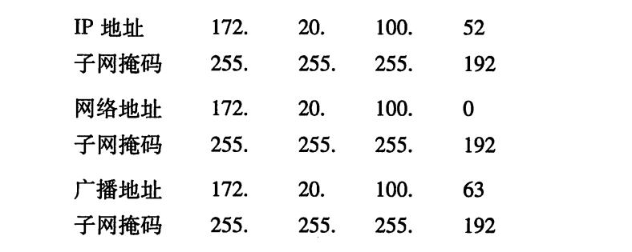

另一种表示方式如下所示。它在每个IP地址后面追加网络地址的位数用"/"隔开。

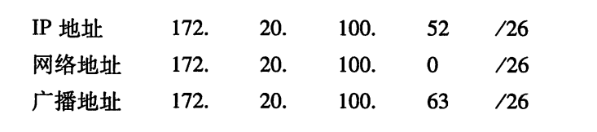

不难看出，在第二种方式下记述网络地址时可以省略后面的“0”。例如172.20.0.0/16 跟 172.20/16 其实是一个意思。

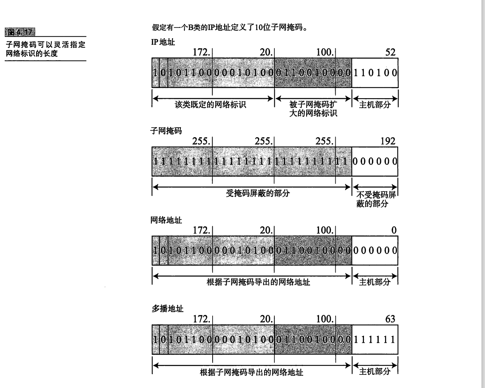


### CIDR 与VLSM

**直到 20 世纪 90年代中期，向各种组织分配IP地址都以类、B类、C类等分类为单位进行**。对于架构大规模网络的组织，一般会分配一个A类地址。反之，**在架构小规模网络时，则分配C类地址**。**然而A类地址的派发在全世界最多也无法超过128个**，**加上C类地址的主机标识最多只允许254台计算机相连，导致众多组织开始申请 B类地址。其结果是B类地址也开始严重缺乏，无法满足需求**。

>这哪行啊，肯定得任意长度分割IP地址的网络标识和主机标识。

于是，人们开始放弃IP地址的分类"，采用任意长度分割IP地址的网络标识和主机标识。这种方式叫做CIDR"，意为“无类型域间选路”。由于BGP(Border Gateway Protocol，边界网关协议，参考7.6节)对应了CIDR，所以不受IP 地址分类的限制自由分配

根据CIDR，连续多个C类地址"就可以划分到一个较大的网络内。CIDR更有效地利用了当前 IPv4 地址，同时通过路由集中"降低了路由器的负担。

例如，以图4.18为例，应用CIDR技术将203.183.224.1到203.183.225.254的地址合为同一个网络(它们本来是2个C类地址)。

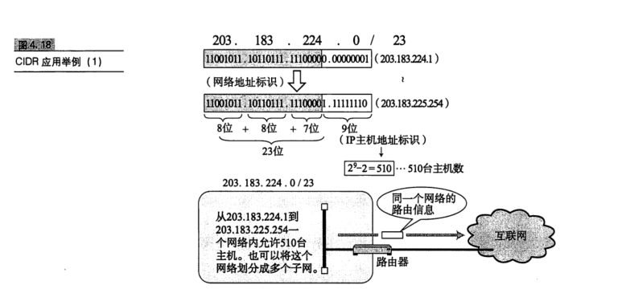

类似地，图4.19 展示了将202.244.160.1到202.244.167.254 的地址合并为一个网络的情形。该例子中实际上是将8个C类地址合并为一个网络。

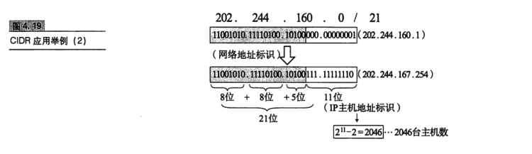

在 CIDR被应用到互联网的初期，网络内部采用固定长度的子网掩码机制。也就是说，当子网掩码的长度被设置为/25 以后，域内所有的子网掩码都得使用同样的长度。然而，有些部门可能有500台主机，另一些部门可能只有50台主机。如果全部采用统一标准，就难以架构一个高效的网络结构。为此人们提出组织内要使用可变长度的、高效的 IP 地址分配方式。

于是产生了一种可以随机修改组织内各个部门的子网掩码长度的机制VLSM(可变长子网掩码)。它可以通过域间路由协议转换为RIP2(7.4.5节)以及OSPF(7.5节)实现。根据 VLSM可以将网络地址划分为主机数为500个时
子网掩码长度为/23，主机数为50个时子网掩码长度为/26。从而在理论上可以将IP 地址的利用率提高至 50%。

有了 CIDR 和 VLSM 技术，确实相对缓解了全局P地址不够用的问题。但是 IP 地址的绝对数本身有限的事实无法改变。因此才会出现本章4.6节中将要介绍的 IPv6 等 IPv4 以外的方法。

>为了对应全局 IP 地址不足的问题，除了 CIDR 和VLSM 之外还有 NAT(5.6节)、代理服务器(1.9.7节)等技术。


### 全局地址与私有地址

起初，互联网中的任何一台主机或路由器必须配有一个唯一的里 地址。一旦出现 IP 地址冲突，就会使发送端无法判断究竟应该发给哪个地址。而接收端收到数据包以后发送回执时，由于地址重复，发送端也无从得知究竟是哪个主机返回的信息，影响通信的正常进行。

然而，随着互联网的迅速普及，IP地址不足的问题日趋显著。如果一直按照现行的方法采用唯一地址的话，会有IP地址耗尽的危险。
于是就出现了一种新技术。它不要求为每一台主机或路由器分配一个固定的IP 地址，而是在必要的时候只为相应数量的设备分配唯一的IP地址。

尤其对于那些没有连接互联网的独立网络中的主机，只要保证在这个网络内地址唯一，可以不用考虑互联网即可配置相应的IP地址。不过，即使让每个独立的网络各自随意地设置 IP地址，也可能会有问题"。于是又出现了私有网络的IP地址。它的地址范围如下所示:

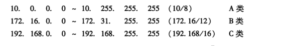

包含在这个范围内的IP地址都属于私有，而在此之外"的P地址称为全局 IP（也叫公网IP）。

私有 IP 最早没有计划连接互联网，而只用于互联网之外的独立网络。然而，当一种能够互换私有IP与全局IP的NAT"技术诞生以后，配有私有地址的主机与配有全局地址的互联网主机实现了通信。

现在有很多学校、家庭、公司内部正采用在每个终端设置私有IP，而在路由器(宽带路由器)或在必要的服务器上设置全局地址的方法。而如果配有私有IP的地址主机连网时，则通过NAT 进行通信。

全局 IP地址基本上要在整个互联网范围内保持唯一，但私有地址不需要。只要在同一个域里保证唯一即可。在不同的域里出现相同的私有 IP 不会影响使用。
由此，私有IP地址结合 NAT技术已成为现在解决IP地址分配问题的主流方案。它与使用全局 IP 地址相比有各种限制。为了解决这些问题正Pv6出现了。然而由于现在 IPv6 还没有得到普及，IPv4 地址又即将耗尽，人们正在努力使用 IPv4和 NAT 技术解决现有的问题。这也是互联网的现状之一。

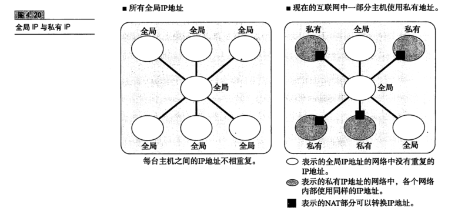


## 路由控制

发送数据包时所使用的地址是网络层的地址，即IP地址。然而仅仅有IP地址还不足以实现将数据包发送到对端目标地址，在数据发送过程中还需要类似于指明路由器或主机”的信息，以便真正发往目标地址。保存这种信息的就是路由控制表(RoutingTable)。实现IP通信的主机和路由器都必须持有一张这样的表。它们也正是在这个表格的基础上才得以进行数据包发送的。

该路由控制表的形成方式有两种:一种是管理员手动设置，另一种是路由器与其他路由器相互交换信息时自动刷新。前者也叫静态路由控制，而后者叫做动态路由控制。为了让动态路由及时刷新路由表，在网络上互连的路由器之间必须设置好路由协议，保证正常读取路由控制信息。


### IP 地址与路由控制

IP地址的网络地址部分用于进行路由控制。图4.22 即发送 IP 包的示例。

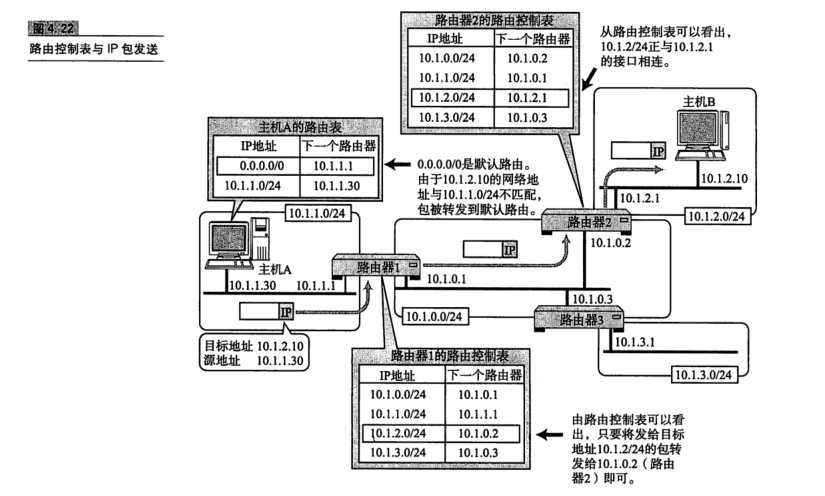

路由控制表中记录着网络地址与下一步应该发送至路由器的地址。在发送IP包时，首先要确定IP 包首部中的目标地址，再从路由控制表中找到与该地址具有相同网络地址的记录，根据该记录将 IP 包转发给相应的下一个路由器。如果路由控制表中存在多条相同网络地址的记录，就选择一个最为吻合的网络地址。所谓最为吻合是指相同位数最多的意思。

例如172.20.100.52的网络地址与172.20/16 和172.20.100/24 两项都匹配。此时，应该选择匹配度最长的172.20.100/24。此外，如果路由表中下一个路由器的位置记录着某个主机或路由器网卡的IP地址，那就意味着“发送的目标地址属于同一个链路”


- 默认路由

  如果一张路由表中包含所有的网络及其子网的信息，将会造成无端的浪费。这时，默认路由(Default Route)是不错的选择。默认路由是指路由表中任何一个地址都能与之匹配的记录。

- 主机路由

  “IP地址/32”也被称为主机路由(Host Route)。例如，192.168.153.15/32就是一种主机路由。它的意思是整个正地址的所有位都将参与路由。进行主机路由，意味着要基于主机上网卡上配置的IP地址本身，而不是基于该地址的网络地址部分进行路由。
  主机路由多被用于不希望通过网络地址路由的情况。

- 环回地址

  环回地址是在同一台计算机上的程序之间进行网络通信时所使用的一个默认地址。计算机使用一个特殊的IP地址127.0.0.1作为环回地址。与该地址具有相同意义的是一个叫做1ocalhost 的主机名。使用这个正P或主机名时，数据包不会流向网络。


### 路由控制表的聚合

利用网络地址的比特分布可以有效地进行分层配置。对内即使有多个子网掩码，对外呈现出的也是同一个网络地址。这样可以更好地构建网络，通过路由信息的聚合可以有效地减少路由表的条目。

如图 4.23 所示，在聚合之前需要6条路由记录，聚合之后只需要2条记录。能够缩小路由表的大小是它最大的优势。路由表越大，管理它所需要的内存和 CPU也就越多。并且查找路由表的时间也会越长，导致转发IP数据包的性能下降。如果想要构建大规模、高性能网络，则需要尽可能削减路由表的大小。

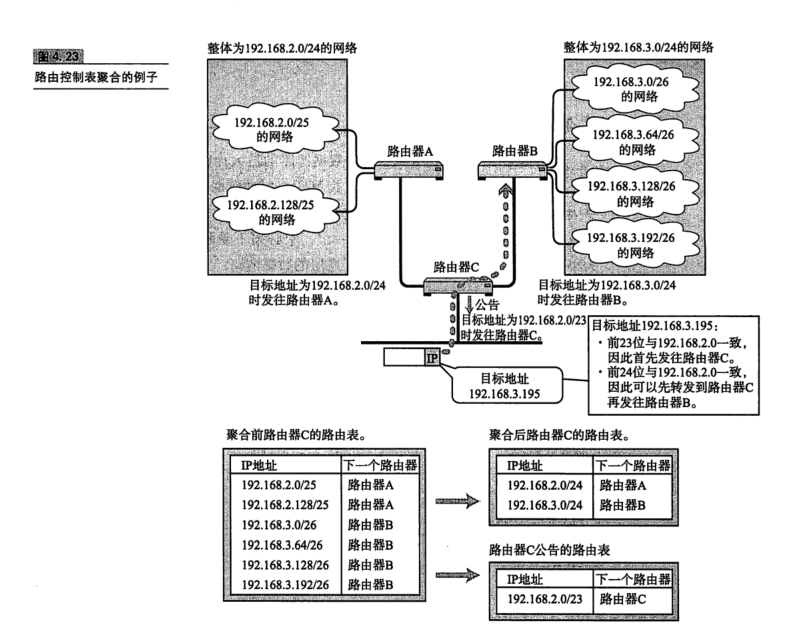


## IPv6


### IPv6 的必要性

IPv6(IP version6)是为了根本解决 IPv4 地址耗尽的问题而被标准化的网际协议。IPv4的地址长度为4个8位字节，即32比特。而IPv6的地址长度则是原来的4倍，即128比特，一般写成8个16位字节。


### IPv6 的特点

IPv6 具有以下几个特点。这些功能中的一部分在IPv4中已经得以实现。然而，即便是那些实现IPv4 的操作系统，也并非实现了所有的IPv4功能。这中间不乏存在根本无法使用或需要管理员介人才能实现的部分。而v6则将这些通通作为必要的功能，减轻了管理员的负担。

- IP 地址的扩大与路由控制表的聚合

  IP地址依然适应互联网分层构造。分配与其地址结构相适应的IP地址，尽可能避免路由表膨大。

- 性能提升

  包首部长度采用固定的值(40字节)，不再采用首部检验码。简化首部结构，减轻路由器负荷。路由器不再做分片处理(通过路径MTU发现只由发送端主机进行分片处理)。

- 支持即插即用功能

  即使没有 DHCP服务器也可以实现自动分配IP地址。

- 采用认证与加密功能

  应对伪造 IP地址的网络安全功能以及防止线路窃听的功能(IPsec)。

- 多播、Mobile IP 成为扩展功能

  多播和 Mobile IP被定义为IPv6的扩展功能。由此可以预期，曾在 IPv4中难于应用的这两个功能在 IPv6 中能够顺利使用。


