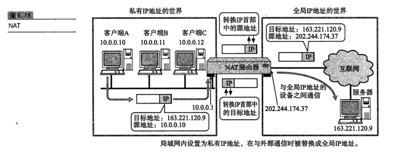
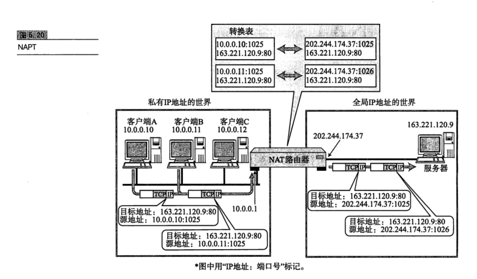
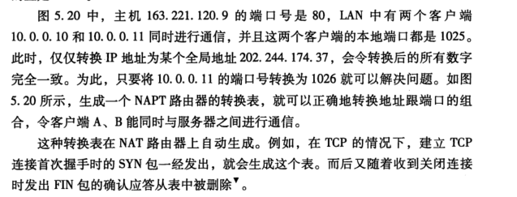

# IP协议相关技术

## NAT

### NAT 定义

NAT(Network AddressTranslator)是用于在本地网络中使用私有地址，在连接互联网时转而使用全局IP地址的技术。除转换IP地址外，还出现了可以转换TCP、UDP端口号的NAPT(Network Address Ports Translator)技术，由此可以实现用一个全局 IP 地址与多个主机的通信"。具体可参考图5.19 和图5.20 的构造。

NAT(NAPT)实际上是为正在面临地址枯竭的IPv4而开发的技术。不过在Pv6 中为了提高网络安全也在使用NAT，在IPv4和IPv6 之间的相互通信当中常常使用NAT-PT。

### NAT 的工作机制

如图5.19所示，以10.0.0.10的主机与163.221.120.9的主机进行通信为例。利用NAT，途中的NAT路由器将发送源地址从10.0.0.10转换为全局的P地址(202.244.174.37)再发送数据。反之，当包从地址163.221.120.9发过来时，目标地址(202.244.174.37)先被转换成私有IP地址10.0.0.10 以后再被转发。

在NAT(NAPT)路由器的内部，有一张自动生成的用来转换地址的表。当10.0.0.10向163.221.120.9 发送第一个包时生成这张表，并按照表中的映射关系进行处理。
当私有网络内的多台机器同时都要与外部进行通信时，仅仅转换地址，人们不免担心全局 IP 地址是否不够用。这时采用如图5.20 所示的包含端口号一起转换的方式(NAPT)可以解决这个问题。

关于这一点，第六章有更详细的说明。不过在此需要注明的一点是，在使用TCP 或 UDP 的通信当中，只有目标地址、源地址、目标端口、源端口以及协议类型(TCP还是UDP)五项内容都一致时才被认为是同一个通信连接。此时所使用的正是 NAPT。

