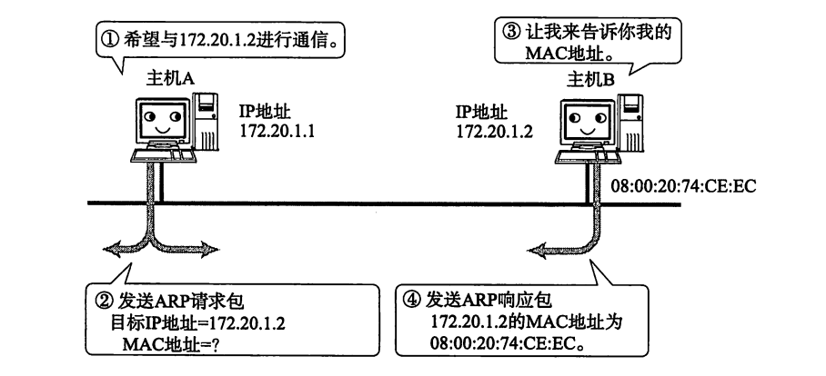
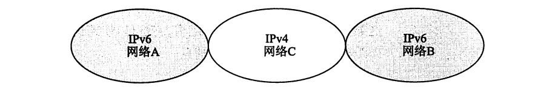
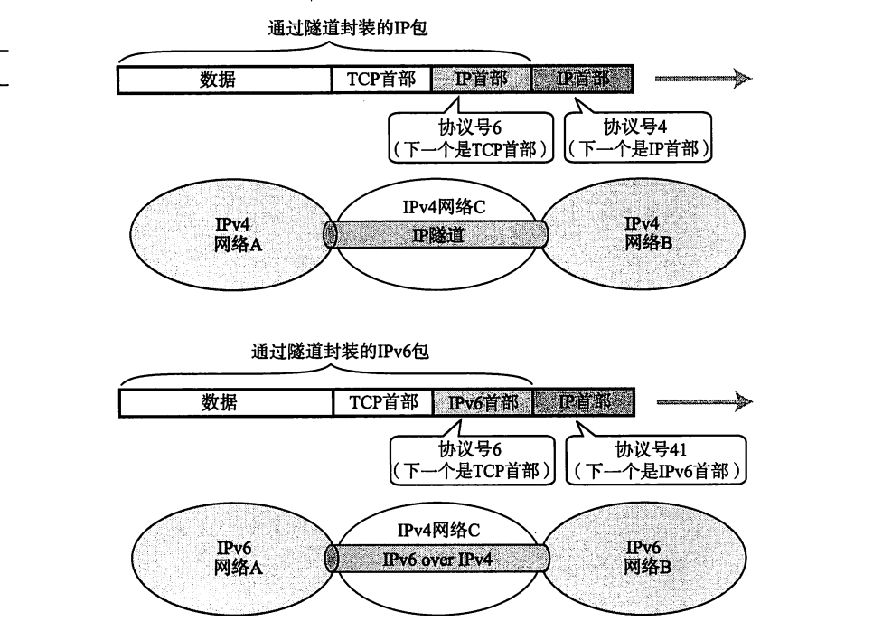

# IP协议相关技术

## ARP

只要确定了IP地址，就可以向这个目标地址发送IP数据报。然而，在底层数据链路层，进行实际通信时却有必要了解每个IP地址所对应的 MAC地址。

### ARP 概要

ARP是一种解决地址问题的协议。以目标IP地址为线索，用来定位下一个应该接收数据分包的网络设备对应的MAC地址。如果目标主机不在同一个链路上时，可以通过 ARP查找下一跳路由器的MAC地址。不过ARP只适用于IPv4，不能用于IPv6。IPv6中可以用ICMPv6替代 ARP 发送邻居探索消息。

### ARP 的工作机制

那么ARP又是如何知道MAC地址的呢?简单地说，ARP是借助ARP请求与ARP 响应两种类型的包确定 MAC 地址的。
如图5.6所示，假定主机A向同一链路上的主机B发送IP包，主机A的IP地址为172.20.1.1，主机B的IP地址为172.20.1.2，它们互不知道对方的 MAC地址。

主机A为了获得主机B的MAC地址，起初要通过广播发送一个ARP请求包。这个包中包含了想要了解其MAC地址的主机IP地址。也就是说，ARP请求包中已经包含了主机B的IP地址172.20.1.2。由于广播的包可以被同一个链路上所有的主机或路由器接收，因此 ARP的请求包也就会被这同一个链路上所有的主机和路由器进行解析。如果ARP请求包中的目标IP地址与自己的IP地址一致，那么这个节点就将自己的 MAC 地址塞人 ARP 响应包返回给主机 A。

根据 ARP可以动态地进行地址解析，因此，在TCP/IP的网络构造和网络通信中无需事先知道 MAC 地址究竟是什么，只要有IP地址即可。

如果每发送一个IP数据报都要进行一次 ARP 请求以此确定 MAC 地址，那将会造成不必要的网络流量，因此，通常的做法是把获取到的MAC地址缓存一段时间。即把第一次通过 ARP 获取到的 MAC 地址作为IP对 MAC 的映射关系记忆到一个ARP 缓存表中，下一次再向这个IP地址发送数据报时不需再重新发送ARP请求，而是直接使用这个缓存表当中的MAC地址进行数据报的发送。每执行一次 ARP，其对应的缓存内容都会被清除。不过在清除之前都可以不需要执行ARP就可以获取想要的MAC地址。这样，在一定程度上也防止了ARP包在网络

## NAT

### NAT 定义

NAT(Network AddressTranslator)是用于在本地网络中使用私有地址，在连接互联网时转而使用全局IP地址的技术。除转换IP地址外，还出现了可以转换TCP、UDP端口号的NAPT(Network Address Ports Translator)技术，由此可以实现用一个全局 IP 地址与多个主机的通信"。具体可参考图5.19 和图5.20 的构造。

NAT(NAPT)实际上是为正在面临地址枯竭的IPv4而开发的技术。不过在Pv6 中为了提高网络安全也在使用NAT，在IPv4和IPv6 之间的相互通信当中常常使用NAT-PT。

### NAT 的工作机制

如图5.19所示，以10.0.0.10的主机与163.221.120.9的主机进行通信为例。利用NAT，途中的NAT路由器将发送源地址从10.0.0.10转换为全局的P地址(202.244.174.37)再发送数据。反之，当包从地址163.221.120.9发过来时，目标地址(202.244.174.37)先被转换成私有IP地址10.0.0.10 以后再被转发。

在NAT(NAPT)路由器的内部，有一张自动生成的用来转换地址的表。当10.0.0.10向163.221.120.9 发送第一个包时生成这张表，并按照表中的映射关系进行处理。
当私有网络内的多台机器同时都要与外部进行通信时，仅仅转换地址，人们不免担心全局 IP 地址是否不够用。这时采用如图5.20 所示的包含端口号一起转换的方式(NAPT)可以解决这个问题。

关于这一点，第六章有更详细的说明。不过在此需要注明的一点是，在使用TCP 或 UDP 的通信当中，只有目标地址、源地址、目标端口、源端口以及协议类型(TCP还是UDP)五项内容都一致时才被认为是同一个通信连接。此时所使用的正是 NAPT。

## IP 隧道

在一个如图5.22所示的网络环境里，网络A、B使用IPv6，如果处于中间位置的网络C支持使用IPv4的话，网络A与网络B之间将无法直接进行通信。为了让它们之间正常通信，这时必须得采用IP隧道的功能。

IP隧道中可以将那些从网络A发过来的IPv6的包统和为一个数据，再为之追加一个 IPv4 的首部以后转发给网络C。一般情况下，紧接着IP首部的是TCP或UDP的首部。然而，现在的应用当中“IP首部的后面还是IP首部”或者“IP首部的后面是IPv6的首部”等情况与日俱增。这种在网络层的首部后面继续追加网络层首部的通信方法就叫做“IP 隧道”

