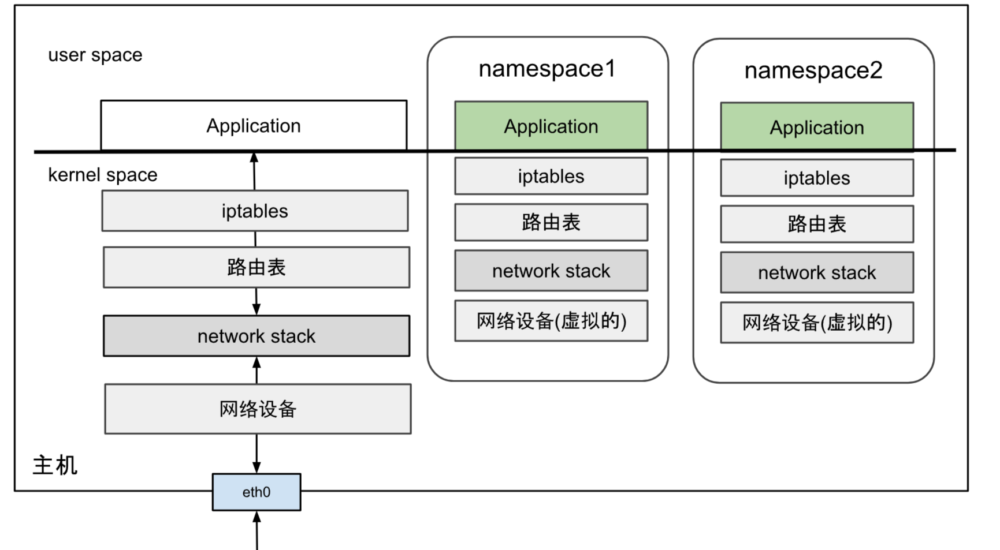
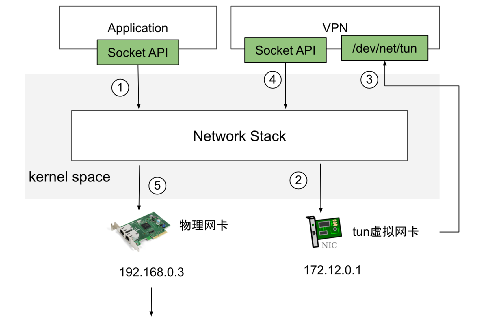
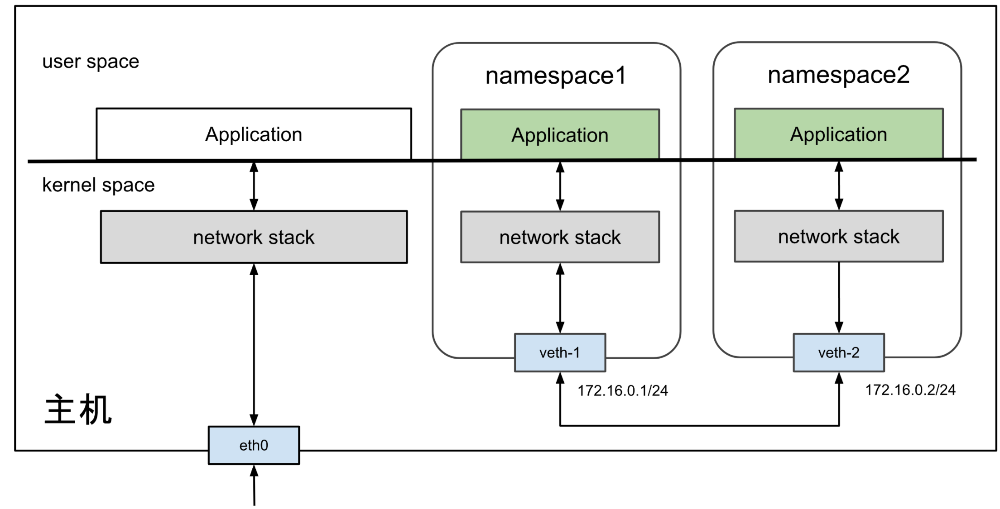
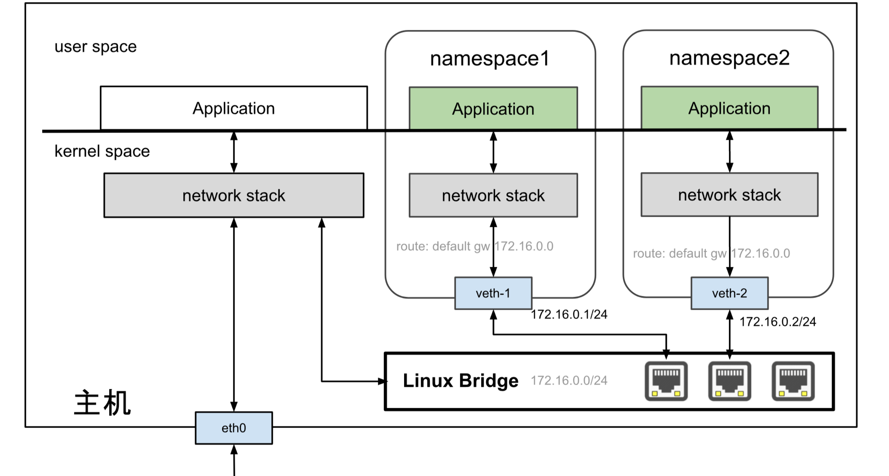
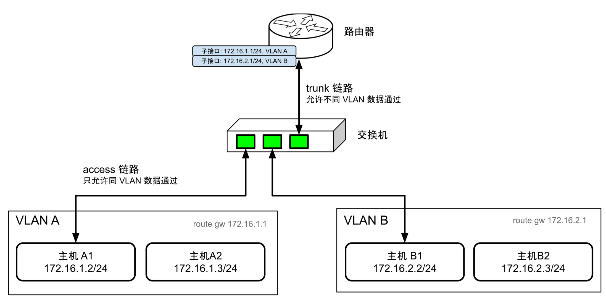
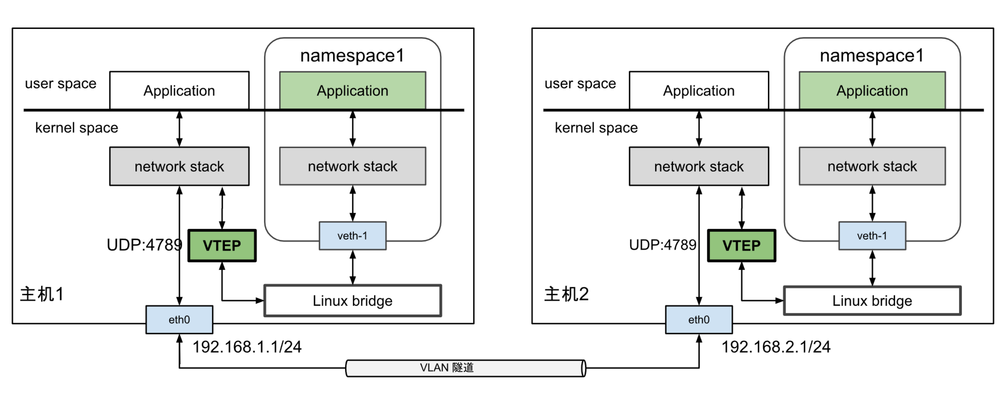

# Linux 网络虚拟化

Linux 网络虚拟化的核心技术主要是网络命名空间和各种虚拟网络设备，如稍后介绍的 Veth、Linux Bridge、TUN/TAP 等。这些虚拟设备由代码实现，完全模拟物理设备的功能。

近年来流行颇广的容器技术，正是基于这些虚拟网络设备，模拟物理设备之间协作方式，将各个独立的网络命名空间连接起来，构建出不受物理环境限制的网络架构，实现容器之间、容器与宿主机之间，甚至跨数据中心的动态网络拓扑。


## 网络命名空间

Linux 内核从 2.4.19 版本起，开始逐步集成多种命名空间技术，以实现对各类资源的隔离。网络命名空间（Network Namespace）是其中最关键的一种，它是各类容器化技术的核心。

有了网络命名空间技术，Linux 系统便能够在一个主机内创建多个独立的网络环境。每个网络命名空间都拥有自己独立的网络资源，包括防火墙规则、网络接口、路由表、ARP 邻居表以及完整的网络协议栈。

当进程运行在一个网络命名空间内，感觉就像独享一台物理主机一样。


								 图 3-12 不同网络命名空间内的网络资源都是隔离的

Linux 系统中，ip 工具的子命令 netns 集成了网络命名空间的增删查改功能。笔者使用 ip 命令演示操作网络命名空间，帮助你加深理解网络命名空间的作用。

首先，创建一个名为 ns1 的网络命名空间。命令如下所示：

```bash
$ ip netns add ns1
```

查询该网络命名空间内的网络设备信息。由于没有经过任何配置，因此该网络命名空间内只有一个名为 lo 的本地回环设备，且该设备的状态为 DOWN。

```bash
$ ip netns exec ns1 ip link list 
1: lo: <LOOPBACK> mtu 65536 qdisc noop state DOWN mode DEFAULT group default qlen 1000
    link/loopback 00:00:00:00:00:00 brd 00:00:00:00:00:00
```

继续查看该网络命名空间下 iptables 规则配置。由于这是一个初始化的网络命名空间，因此它也并没有任何 iptables 规则。

```bash
$ ip netns exec ns1 iptables -L -n
Chain INPUT (policy ACCEPT)
target     prot opt source               destination         

Chain FORWARD (policy ACCEPT)
target     prot opt source               destination         

Chain OUTPUT (policy ACCEPT)
target     prot opt source               destination 
```

不同的网络命名空间之间是相互隔离的，那它们如果想与外界通信（其他网络命名空间、宿主机），该怎么处理呢？

我们先看看物理机是怎么操作的：一台物理机如果要想与外界进行通信，那得插入一块网卡，通过网线连接到以太网交换机，加入一个局域网内。被隔离的网络命名空间如果想与外界进行通信，就需要利用到稍后介绍的各类虚拟网络设备。也就是在网络命名空间里面插入“虚拟网卡”，然后把“网线”的另一头桥接到“虚拟交换机”中。

没错，这些操作完全和物理环境中的局域网配置一样，只不过全部是虚拟的，用代码实现的而已。


## 虚拟网络设备 TUN 和 TAP

TUN 和 TAP 是 Linux 内核 2.4.x 版本之后引入的虚拟网卡设备，主要用于用户空间（user space）和内核空间（kernel space）双向传输数据。这两种设备的区别与含义为：

- TUN 设备是虚拟网络接口设备，工作在网络层（Layer 3），主要处理 IP 数据包。它模拟了一个网络层接口，可以让用户空间程序接收和发送 IP 数据包；
- TAP 设备也是虚拟网络接口，但它工作在数据链路层（Layer 2），主要处理 以太网帧。与 TUN 设备不同，TAP 设备传递的是完整的以太网帧，包括数据链路层头部，允许用户空间程序发送和接收以太网帧。

Linux 系统中，内核空间和用户空间之间数据传输有多种方式，字符设备文件是其中一种。TUN/TAP 对应的字符设备文件为 /dev/net/tun。

当用户空间的程序 open() 字符设备文件时，返回一个 fd 句柄，同时字符设备驱动创建并注册相应的虚拟网卡网络接口，并以 tunX 或 tapX 命名。当用户空间的程序向 fd 执行 read()/write() 时，就可以和内核网络互通了。

TUN 和 TAP 两者工作原理基本相同，只是工作的网络层面不一样。如图 3-13 所示，笔者以 TUN 设备构建 VPN 隧道为例，说明其工作原理：

- 首先，一个普通的用户程序发起一个网络请求；

- 接着，数据包进入内核协议栈时并找路由。大致的路由规则如下:

  ```bash
  $ ip route show
  default via 172.12.0.1 dev tun0  // 默认流量经过 tun0 设备
  192.168.0.0/24 dev eth0  proto kernel  scope link  src 192.168.0.3
  ```

- tun0 设备字符文件 /dev/net/tun 由 VPN 程序打开。所以，第一步用户程序发送的数据包被 VPN 程序接管。

- VPN 程序对数据包进行封装操作，“封装”是指将一个数据包包装在另一个数据包中，就像将一个盒子放在另一个盒子中一样。封装后的数据再次被发送到内核，最后通过 eth0 接口（也就是图中的物理网卡）发出。


										*图 3-13 VPN 中数据流动示意图*

将一个数据包封装到另一个数据包是构建网络隧道，实现虚拟网络的典型方式。

本书第七章介绍的容器网络插件 Flannel，早期的设计中曾使用 TUN 设备实现了 UDP 模式下的跨主机通信，但使用 TUN 设备传输数据需要经过两次协议栈，且有多次的封包/解包过程，产生额外的性能损耗。这是后来 Flannel 弃用 UDP 模式的主要原因。


## 虚拟网卡 Veth

Linux 内核 2.6 版本支持网络命名空间的同时，也提供了专门的虚拟网卡 Veth（Virtual Ethernet，虚拟以太网网卡）。

Veth 实现原理的本质是一种“反转数据传输方向”的实现，即：在内核中将需要被发送的数据包“反转"为新接收到的数据包，重新进入内核网络协议栈中处理。通俗的解释，Veth 就是一根带着两个“水晶头”的“网线”，从网线的一头发送数据，另一头就会收到数据。因此，Veth 也被说成是“一对设备”（Veth-Pair）。

Veth 的典型应用是连接隔离的网络命名空间，让它们可以互相通信。假设有两个网络命名空间 ns1 和 ns2，它们的网络拓扑结构如图 3-14。接下来，笔者将通过操作演示，帮助你理解 Veth 设备如何实现网络命名空间之间的互通。


												*图 3-14 Veth 设备对*

首先，创建一对 Veth 设备，它们的名称分别为 veth1 和 veth2。命令如下所示：

```bash
$ ip link add veth1 type veth peer name veth2
```

接下来，要做的是把这对设备分别放到 ns1 和 ns2 中。命令如下所示：

```bash
$ ip link set veth1 netns ns1
$ ip link set veth2 netns ns2
```

Veth 是虚拟的网络设备，因此具备虚拟网卡的特征。即可配置 IP/MAC 地址。接下来，给 Veth 设备配置上 ip 地址，它们的 IP 地址处于同一个子网 172.16.0.1/24 中，同时激活 Veth 设备。

```bash
# 配置命名空间1
$ ip netns exec ns1 ip link set veth1 up
$ ip netns exec ns1 ip addr add 172.16.0.1/24 dev veth1
# 配置命名空间2
$ ip netns exec ns2 ip link set veth2 up
$ ip netns exec ns2 ip addr add 172.16.0.2/24 dev veth2
```

Veth 设备配置完 ip 之后，每个网络命名空间中会自动生成对应的路由信息。

```bash
$ ip netns exec ns1 ip route
172.16.0.0/24 dev veth1  proto kernel  scope link  src 172.16.0.1
```

上面的路由配置表明，凡是属于 172.16.0.0/24 网段的数据包都会通过 veth1 发送。自然地，通过 veth1 接口发送的数据包会被 veth2 接收到。在 ns1 中进行 ping 测试，可以看到两个命名空间已经连通了。

```bash
$ ip netns exec ns1 ping -c10 172.16.0.2
PING 172.16.0.2 (172.16.0.2) 56(84) bytes of data.
64 bytes from 172.16.0.2: icmp_seq=1 ttl=64 time=0.121 ms
64 bytes from 172.16.0.2: icmp_seq=2 ttl=64 time=0.063 ms
```

虽然 Veth 设备模拟网卡直连的方式解决了两个容器之间的通信问题，但面对多个容器间通信需求，如果只用 Veth 设备的话，事情就会变得非常麻烦。让每个容器都为与它通信的其他容器建立一对专用的 Veth 设备，根本不切实际。

此时，就迫切需要一台虚拟化交换机来解决多容器之间的通信问题，这正是笔者前面多次提到的 Linux bridge。


## 虚拟交换机 Linux bridge

在物理网络中，通常使用交换机连接多台主机，组成小型局域网。Linux 网络虚拟化技术中，也提供了物理交换机的虚拟实现 —— Linux bridge（Linux 网桥，也称虚拟交换机）。

Linux bridge 作为虚拟交换机，功能与物理交换机类似。通过 brctl 命令将多个网络接口（如物理网卡 eth0、虚拟接口 veth、tap 等）桥接后，它们的通信方式与物理交换机的转发行为一致。当数据帧进入 Linux bridge 时，系统根据数据帧的类型和目的地 MAC 地址执行以下处理：

- 对于广播帧，转发到所有桥接到该 Linux bridge 的设备。
- 对于单播帧，查找 FDB（Forwarding Database，地址转发表）中 MAC 地址与设备网络接口的映射记录：
  - 若未找到记录，执行“洪泛”（Flooding），然后根据“泛红”响应将设备的网络接口与 MAC 地址记录到 FDB 表中；
  - 若找到记录，直接将数据帧转发到对应设备的网络接口。

举一个具体的例子，使用 Linux bridge 将两个命名空间接入到同一个二层网络。该例子的网络拓扑结构如图 3-15 所示。


											*图 3-15 veth 网卡与 Linux Bridge*

创建 Linux bridge 与其他虚拟网络设备类似，只需将 type 参数指定为 bridge 即可。

```bash
$ ip link add name br0 type bridge
$ ip link set br0 up
```

创建的 Linux bridge 一端连接到主机协议栈，而其他端口尚未连接任何设备。为了实现其功能，需要将其他设备连接到该 bridge。接下来，我们将创建网络命名空间和 veth 设备，并将 veth 的一端连接到网络命名空间，另一端连接到刚创建的 br0 桥接设备。

```bash
# 创建网络命名空间
$ ip netns add ns1
$ ip netns add ns2

# 创建 veth 网线
$ ip link add veth0 type veth peer name veth1
$ ip link add veth2 type veth peer name veth3

# 将 veth 网线的一端连接到网络命名空间内
$ ip link set veth0 netns ns1
$ ip link set veth2 netns ns2

# 将 veth 另一端连接到 br0
$ ip link set dev veth1 master br0
$ ip link set dev veth3 master br0
```

激活网络命名空间内的虚拟网卡，并为它们设置 IP 地址。这些 IP 地址位于同一个子网 172.16.0.0/24 中。

```bash
# 配置命名空间1
$ ip netns exec ns1 ip link set veth0 up
$ ip netns exec ns1 ip addr add 172.16.0.1/24 dev veth0
# 配置命名空间2
$ ip netns exec ns2 ip link set veth2 up
$ ip netns exec ns2 ip addr add 172.16.0.2/24 dev veth2
```

接下来，检查网络命名空间之间是否可达。

```bash
ip netns exec ns1 ping 172.16.0.2
PING 172.16.0.2 (172.16.0.2) 56(84) bytes of data.
64 bytes from 172.16.0.1: icmp_seq=1 ttl=64 time=0.153 ms
64 bytes from 172.16.0.1: icmp_seq=2 ttl=64 time=0.148 ms
64 bytes from 172.16.0.1: icmp_seq=3 ttl=64 time=0.116 ms
```

通过上述实验，我们验证了使用 Linux bridge 可以将多个命名空间连接到同一个二层网络中。

你可能注意到，我们仅为命名空间内的 veth 接口分配了 IP 地址，而未为连接到 Linux bridge 的另一端分配地址。这是因为 Linux bridge 工作在数据链路层（第二层），主要负责 ARP 解析、以太网帧转发以及广播等工作。

但与物理二层交换机不同的是，Linux bridge 本质上是 Linux 系统中的虚拟**网络设备**，具备网卡特性，可以配置 MAC 和 IP 地址。从主机的角度来看，配置了 IP 地址的 Linux bridge 设备相当于主机上的一张网卡，能够参与数据包的 IP 路由。因此，当将网络命名空间的默认网关设置为 Linux bridge 的 IP 地址时，原本被隔离的网络命名空间便可以与主机通信。

实现容器与主机之间的互通是容器跨主机通信的关键步骤。笔者将在第七章的 7.6 节中详细阐述容器跨主机通信的原理。


## 虚拟网络通信技术

容器分布在不同的物理主机之上，物理主机通过交换机、路由器等设备互联。

从上述看出，基于物理设备实现的网络拓扑结构是相对固定的，很难跟得上云原生时代下系统频繁变动的频率。例如，容器的动态扩缩容、集群跨数据中心迁移等等，都要求网络拓扑随时做出调整。正因为如此，软件定义网络（Software Defined Networking，SDN）的需求变得前所未有的迫切。

SDN 思想的核心是，在现有的物理网络之上新增一层虚拟网络，将控制平面（操作系统和各类网络控制软件等）和数据平面（底层通信的物理设备，以及各类通信协议等）解耦，将网络服务从底层硬件设备中抽象出来，由代码直接编程控制。

SDN 网络模型如图 3-16 所示：

- 位于下层的网络称 Underlay 网络，它是由路由器、交换机等硬件设备互联而成的物理网络，负责网络之间的数据传输；
- 位于上层的网络称 Overlay 网络，它是采用多种网络虚拟化技术在 Underlay 网络之上创建的虚拟网络。


							*图 3-16 SDN 网络中 Overlay 与 Underlay 网络模型*

SDN 的发展要早于云原生十余年，发展过程中出现多种 Overlay 网络的具体实现，如 Geneve（Generic Network Virtualization Encapsulation）、VXLAN（Virtual Extensible LAN）、STT（Stateless Transport Tunneling）等等。这些技术本质上都属于隧道技术，也就是：“将数据包封装在另一个数据包中，在现有物理网络之上创建一个虚拟网络”。

虚拟网络中的容器不需要关心底层物理网络的路由规则等细节，物理网络也不需要针对容器 IP 进行专门路由等配置。因此，以 VXLAN 为代表的 Overlay 网络作为一种无需调底层网络实现的容器组网技术，快速在容器领域铺开了。

学习 VXLAN 之前，有必要充分了解一些物理网络通信的基本原理。接下来，笔者将先介绍 VXLAN 的前身 VLAN（Virtual Local Area Network，虚拟局域网）技术。


### 虚拟局域网 VLAN

基于以太网的通信中，必须在数据帧中指定目标 MAC 地址才能正常通信，因此计算机必须先广播 ARP 请求，获取目标 MAC 地址。当同一个广播域内设备非常多时，ARP、DHCP、RIP 等机制会产生大量的广播帧，很容易形成广播风暴。因此，VLAN 首要职责是划分广播域（子网），一个 VLAN 一个广播域，将同一个物理网络上的设备从逻辑上区分出来。

举一个具体的例子。将一个广播域所对应的网段 172.16.0.0/16 分割成 255 个子网，各个子网对应的网段为 172.16.1.0/24、172.16.2.0/24、172.16.3.0/24 ... 172.16.255.0/24，各个子网所对应的 VLAN ID 为 1、2、3 ... 255。如此，每个子网的广播域理论可以容纳 255 个终端，广播风暴的影响指数级下降。

VLAN 划分子网的具体方法是在以太帧的报文头中加入 VLAN Tag，广播只针对具有相同 VLAN Tag 的设备生效。对于支持 VLAN 的交换机，能够识别以太帧内的 VLAN ID，从而确保只有属于相同 VLAN ID 的数据包可以互相转发。

通过 VLAN 划分子网固然可以解决广播风暴的频繁出现，但对那些既希望隔离，又希望某些主机能互通场景来说，划分 VLAN 的同时为不同 VLAN 建立互相访问的通道也是必要的。由于两个 VLAN 之间完全隔离的，不存在重合的广播域，因此它们之间的通信只能通过三层路由设备。

最简单的三层路由模式通过单臂路由实现。单臂路由的网络拓扑如图 3-17 所示。路由器和交换机之间只有一条线路，该线路称 Trunk 链路。与之相对的，主机与交换机之间的链路称 Access 链路。Trunk 链路允许任何 VLAN ID 的数据包通过。需要路由的数据包通过 Trunk 链路到达路由器，路由后原路返回至交换机转发处理。所以大家给这种拓扑起了一个形象的名字 —— 单臂路由。

说白了，单臂路由就是从哪个口进去，再从哪个口出来，而不像传统网络拓扑中数据包从某个接口进入路由器又从另外一个接口离开路由器。为了实现上述中的单臂路由模式，以太网 802.1Q 规范中专门定义了“子接口”（Sub-Interface）的概念，它的作用是，同一张物理网卡上，能够针对不同的 VLAN 绑定不同的 IP 地址。将各子网的默认网关配置为对应的子接口地址，路由器通过修改 VLAN tag，即可实现不同 VLAN 之间跨子网的数据转发。


											*图 3-17 VLAN 单臂路由原理*

VLAN 固然通过划分子网的形式解决广播风暴，但它的缺陷也非常明显：

- 第一个缺陷：在于 VLAN Tag 的设计。当时的网络工程师完全未料及云计算会发展得会如此普及，只设计了 12 位 bit 存储 VLAN ID，导致一个 VLAN 子网内的设备数量局限在 4000 个左右，显然无法支持大型数据中心数以万计的设备。
- 第二个缺陷：跨数据中心通信非常麻烦。VLAN 属于二层网络技术，但是两个独立的数据中心之间只能通过三层网络互通。云计算的高速发展下，一个业务跨多个数据中心部署成为普遍需求，数据中心之间传递 VLAN Tag 又是一件麻烦的事情；特别是系统容器化后，一台物理机内运行着数百个容器，每个容器都有独立的 IP 地址和 MAC 地址，带给路由、交换机等设备的压力成倍增加。


### 虚拟可扩展局域网 VXLAN

为了解决 VLAN 的设计缺陷，IETF 又新定义了 VXLAN（Virtual eXtensible Local Area Network，虚拟可扩展局域网）规范。从名字上看，VXLAN 像是 VLAN 的一种扩展协议，但其实它与 VLAN 有着本质的不同。

VXLAN 属于 NVO3（Network Virtualization over Layer 3，三层虚拟化网络）的标准技术规范之一，属于一种隧道封装技术。VXLAN 的基本原理是，使用 TCP/IP 协议栈中惯用的“封装/解封”手段，将 L2（链路层）以太网帧封装在 L4（传输层）UDP 报文内，然后在 L3（网络层）网络中传输。不同数据中心节点间的通信，就像在同一个广播域内传输一样。

根据图 3-18，我们看到 VXLAN 报文对原始以太网帧（图中的 Original Layer2 Frame）如何封装：

- **VXLAN Header**：其中 24 bits 的 VNI 字段，用来定义 VXLAN 网络中不同的租户，它的容量上限是 1,677 万。
- **UDP Header**：UDP 头中目的端口号（图中的 VXLAN Port）固定为 4789，源端口随机分配。
- **Outer IP Header**：封装目的 IP 地址和源 IP 地址，这里 IP 指的是宿主机的 IP 地址。
- **Outer MAC Header**：封装源 MAC 地址，目的 MAC 地址，这里 MAC 地址指的是宿主机 MAC 地址。


图 3-18 VXLAN 报文结构

在 VXLAN 隧道网络中，负责“封装/解封”的设备称为“VTEP 设备”（VXLAN Tunnel Endpoints，VXLAN 隧道端点），它在 Linux 系统中实际上是一个虚拟 VXLAN 网络接口。当源服务器内的容器发出原始数据帧后，首先在隧道的起点（VTEP 设备）被封装成 VXLAN 格式的报文，然后被主机 IP 网络传递到隧道的终点（也就是目标服务器中的 VTEP 设备）。目标服务器内的 VETP 设备解封 VXLAN 报文，得到原始的数据帧，转发至目标服务器内的某容器。

Linux 内核 3.12 版本起，开始支持完整的 VXLAN 技术（多播模式、单播模式、IPv6 支持等）。三层可达的网络环境下，不需要专门的硬件，简单配置下 Linux 系统，就可以部署 VXLAN 隧道网络。

举一个具体的例子，下面的命令演示了在 Linux 系统中配置 VXLAN 接口并将其绑定到 Linux bridge。

```bash
# 创建一个 bridge
$ brctl addbr br0

# 创建一个 VXLAN 接口，VNI 为 100，指定使用 eth0 作为物理接口
$ ip link add vxlan100 type vxlan id 100 dev eth0 dstport 4789

# 将 VXLAN 接口加入 bridge
$ brctl addif br0 vxlan100

# 启动 bridge 和 VXLAN 接口
$ ip link set up dev br0
$ ip link set up dev vxlan100
```

通过上述配置，当 vxlan100 接口接收到数据包（通过 VXLAN 隧道传输而来）时：

- 首先，进行解封操作，移除 VXLAN 头部和 UDP 头部，提取原始的二层以太网帧；
- 然后，将原始二层以太网帧转发至名为 br0 的 Linux bridge，之后 Linux bridge 根据其连接的网络接口转发至某个网络命名空间。


										  *图 3-19 VXLAN 通信概览*

从上述，我们看到 VXLAN 完美地弥补了 VLAN 的不足：

- 一方面通过 VXLAN 中的 24 bits VNI 字段（如图 3-25 所示）提供多达 1,677 万租户的标识能力，远大于 VLAN 的 4,000；
- 另一方面，VXLAN 本质是构建了一条穿越不同物理网络的“虚拟隧道”，它通过封装原始的 Layer 2（以太网）帧在 Layer 3 网络中传输，使得不同物理网络之间的通信，就像在一个广播域内一样。虚拟机或者容器无论是迁移到 VLAN B 还是 VLAN C，仍然处于同一个二层网络，网络层的配置不需要任何变化。

VXLAN 具有很高的灵活性、扩展性和可管理性，已经成为构建数据中心与容器网络的主流技术，绝大多数公有云的 VPC（Virtual Private Cloud，虚拟私有云）和容器网络都是利用 VXLAN 技术在一个大二层网络上构建。

本书第七章 7.6 节，笔者将以容器网络解决方案 Flannel 的 VXLAN 模式为例，详细讲解容器网络通信过程及原理。
