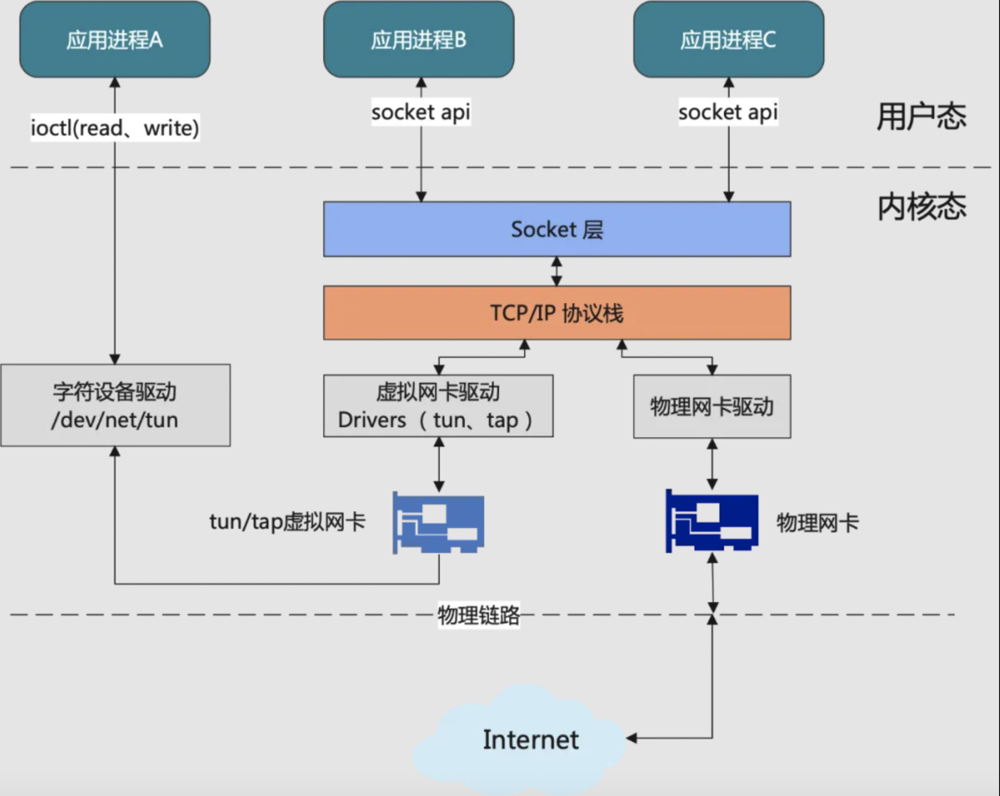
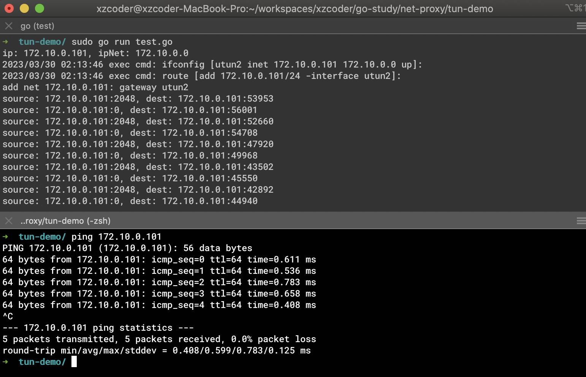
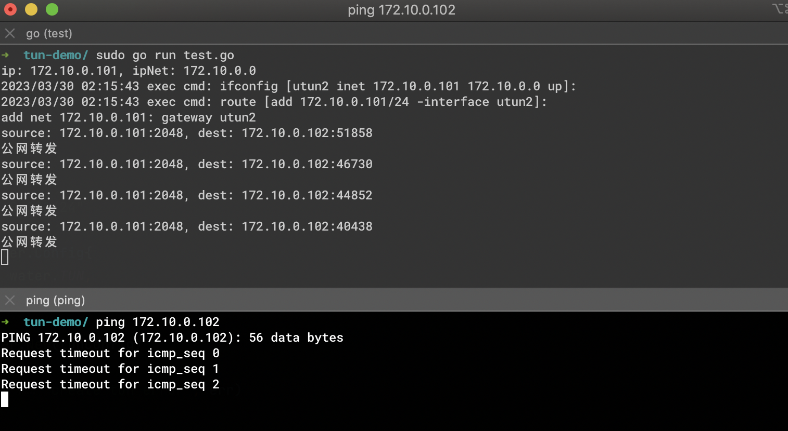
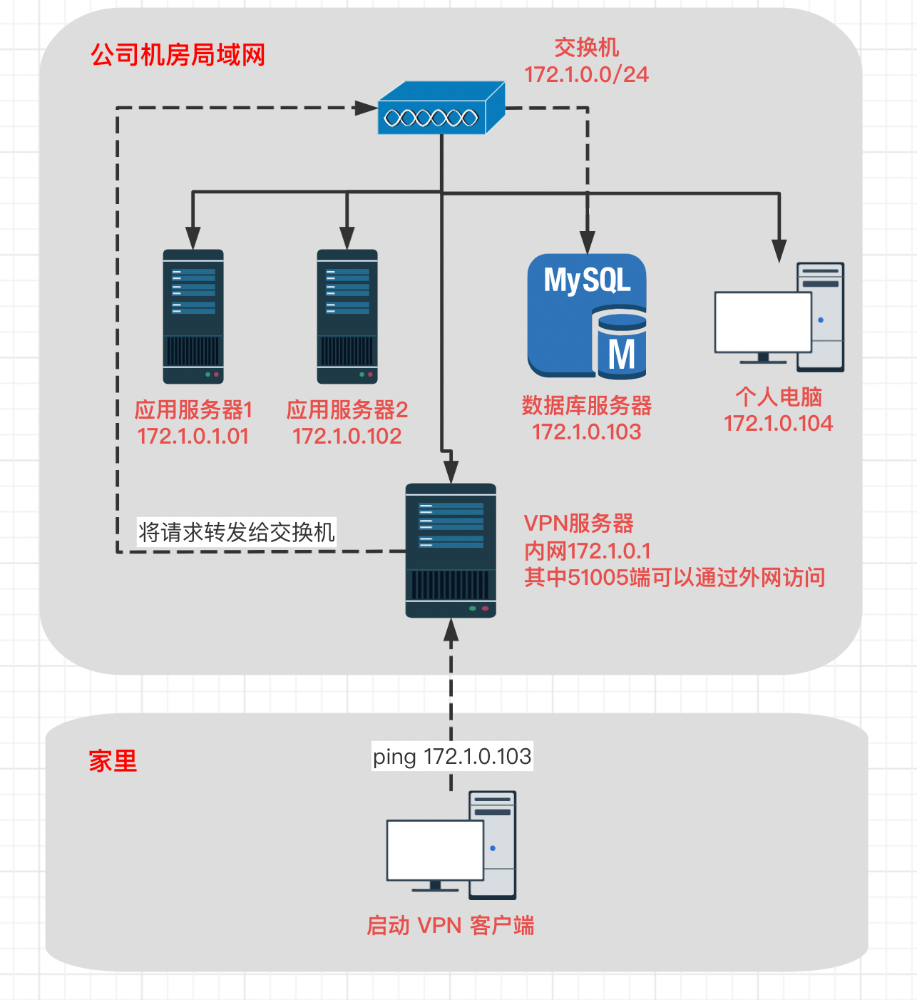
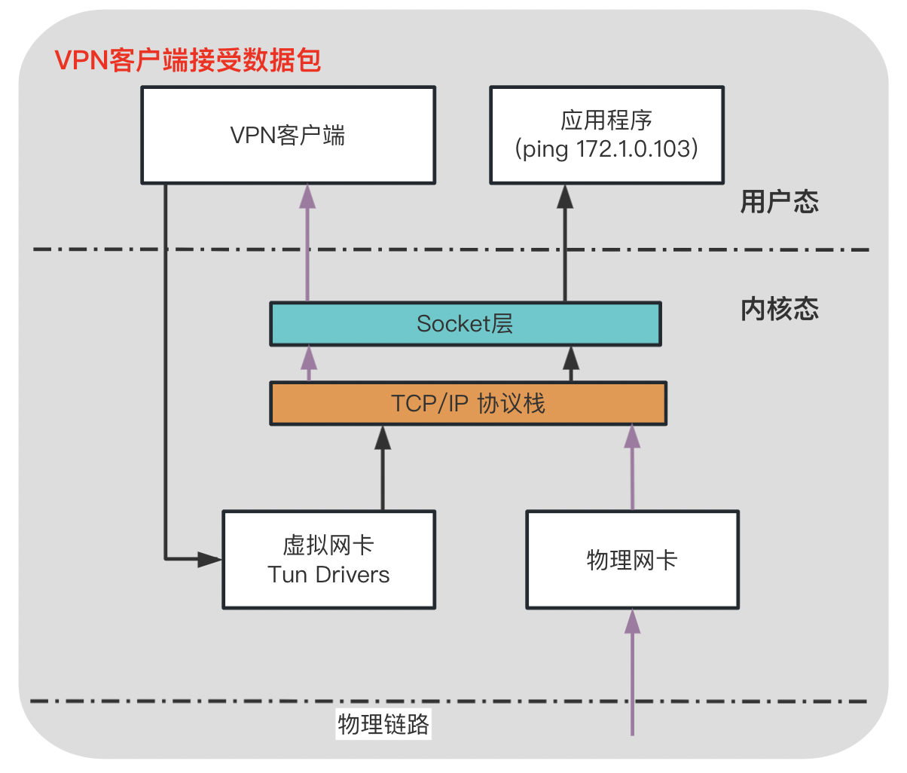

# VPN 原理


## VPN 原理之 TUN/TAP 虚拟网络设备

相信大家在工作中都使用过 VPN，通过 VPN 可以让我们访问到公司局域网内部服务。 本篇文章为大家介绍 VPN 原理中的 TUN/TAP 虚拟网络设备，同时也是后续「手写VPN」教学的基础内容。


###  什么是 TUN/TAP ？

tun/tap 设备是操作系统内核中的虚拟网络设备，是用软件模拟的网络设备，提供与硬件网络设备完全相同的功能。主要用于用户空间和内核空间传递报文。 

tun/tap 设备与物理网卡的区别，如上图所示:

1. 对于硬件网络设备而言，一端连接的是物理网络，一端连接的是网络协议栈。
2. 对于 tun/tap 设备而言，一端连接的是应用程序（通过 字符设备文件 /net/dev/tun），一端连接的是网络协议栈。


### 工作原理



从上图可以更直观的看出 tun/tap 设备和物理设备的区别：虽然它们的一端都是连着网络协议栈，但是物理网卡另一端连接的是物理网络，而 tun/tap 设备另一端连接的是一个应用层程序，这样协议栈发送给 tun/tap 的数据包就可以被这个应用程序读取到，此时这个应用程序可以对数据包进行一些自定义的修改(比如封装成 UDP)，然后又通过网络协议栈发送出去——其实这就是目前大多数“代理”的工作原理。


#### 工作模式

`tun/tap` 有两种模式，`tun`模式 与 `tap`模式。`tun`设备与`tap`设备工作方式完全相同，区别在于：

1. Tun 设备是一个三层设备，从 /dev/net/tun 字符设备上读取的是 IP 数据包，写入的也只能是 IP 数据包，因此不能进行二层操作，如发送 ARP 请求和以太网广播。
2. Tap 设备是二层设备，处理的是二层 MAC 层数据帧，从 /dev/net/tun 字符设备上读取的是 MAC 层数据帧，写入的也只能是 MAC 层数据帧。从这点来看， Tap 虚拟设备和真实的物理网卡的能力更接近，可以与物理网卡做 bridge。


###  应用场景

####  1. VPN

`VPN客户端`通过`Tun`设备读取`IP数据包`发送给`VPN服务端`，再由服务端通过公网转发数据包到对应的`VPN客户端`，最终写入`Tun`设备重新进入到客户端内核协议栈。

开源项目`OpenVPN`就是利用了`tun/tap`驱动实现的隧道封装。


#### 2. 虚拟机 VM

通过KVM创建的多个 VM（虚拟机），以 LinuxBridge（桥接网络）互通；实际上即是通过像`vnet0`这样的`TAP`接口来接入`LinuxBridge`的。


### 代码演示

>本文使用`Go`语言演示`TUN`设备，操作系统使用`Linux`。(本人博客上包含了`Linux`、`MacOS`平台的代码示例，公众号由于文档格式只展示`Linux`平台代码)


#### 使用的代码库

```
Go语言：
github.com/songgao/water: 支持Linux和MacOS系统
golang.zx2c4.com/wireguard/tun：支持Windows系统
Java语言：
github.com/isotes/tun-io：支持Linux和MacOS系统，我并没有用过，有兴趣的可以尝试下
```


####  定义虚拟网卡的IP和网络掩码

```go
// 通过 CIDR 方式进行定义
// ip=172.10.0.101, netmask=255.255.255.0
cidr := "172.10.0.101/24"
```


#### 创建 TUN 设备

```go
import "github.com/songgao/water"
// 网卡配置，指定设备类型为 TUN
// MacOS系统是无法指定 tun 设备名称的，所以这里都不指定了
tunConfig := water.Config{
  DeviceType: water.TUN,
}
dev, err := water.New(tunConfig)
if err != nil {
  log.Fatalln("create tun error", err)
}
defer func() {
  _ = dev.Close()
}()
```


####  启动网卡、设置 IP、添加网段路由表

```go
// 设置网卡 MTU
utils.ExecCmd("/sbin/ip", "link", "set", "dev", dev.Name(), "mtu", 1500)
// 设置网卡 IP 和 网络掩码 （CIDR方式）
utils.ExecCmd("/sbin/ip", "addr", "add", cidr, "dev", dev.Name())
// 启用网卡
utils.ExecCmd("/sbin/ip", "link", "set", "dev", dev.Name(), "up")
```


#### 读取 Tun 网卡数据包

```go
// 缓存区大小与 MTU 一致
buf := make([]byte, 1500)
for {
  n, err := dev.Read(buf)
  if err != nil {
    pance(err)
  }
  // IP 数据包
  data := buf[:n]
  if !waterutil.IsIPv4(data) {
    // 只处理 ipv4 数据包
    continue
  }
  // 来源IP、端口
  srcIp := waterutil.IPv4Source(data)
  srcPort := waterutil.IPv4SourcePort(data)
  // 目标IP
  destIp := waterutil.IPv4Destination(data)
  destPort := waterutil.IPv4DestinationPort(data)
  fmt.Printf("source: %s:%d, dest: %s:%d\n", srcIp.String(), srcPort, destIp.String(), destPort)

  // 如果目标IP与本地 Tun 设备的IP相同，则将数据包写回到 Tun 设备
  if srcIp.Equal(destIp) {
    _, _ = dev.Write(data)
  } else {
    // TODO 将数据通过公网发送给服务端进行转发，并将公网响应数据包写入 Tun 设备
    fmt.Println("公网转发")
  }
}
```


### 效果演示

**ping 本地虚拟网卡IP**

> 由于代码中处理了目标IP与本地IP相同时，数据重新写入回`Tun`设备，所以可以通过本地虚拟IP `ping`通



**ping 相同网段其他IP**

> 代码中未对这类数据包进行处理，所以是无法`ping`通的，后续「手写VPN」教程会完善这部分逻辑



**通过本地虚拟网卡IP访问Nginx服务**


## VPN 原理与实战开发


### 背景介绍



**如上图所示得到如下信息：**

1. 公司局域网网段为 `172.1.0.0/24`
2. 公司局域网内有一台机器安装了`VPN`服务端程序端口为`51005`，且`51005`通过内网穿透的方式可以通过公网进行访问
3. 家里的电脑上安装了`VPN`客户端程序，可以连通公司局域网`VPN`服务器的`51005`端口

**最终目标**

家中的电脑可以直接访问公司局域网的内网`IP`访问局域网中的任意机器，如：`ping 172.1.0.103`访问数据库服务器


###  VPN 客户端工作原理

`VPN`客户端主要负责的工作分为`发送`与`接收`两部分：将应用程序发到`172.1.0.0/24`网段的数据包发送给`VPN`服务端；再将`VPN`服务端返回的数据包返回给应用程序。

下面通过网络传输示意图来分别介绍这两部分的流程

**VPN 客户端发送数据包到服务端**


1. 首先 `VPN`客户端程序会创建一个`Tun`虚拟网络设备，并添加`172.1.0.0/24`网段静态路由指向`Tun`设备
2. 当执行`ping 172.1.0.103` 时，会根据设置的静态路由将数据发送给`Tun`设备
3. `VPN`客户端读取`Tun`数据包，并将数据包转发给公司局域网内的`VPN`服务端程序


**VPN 客户端接收数据包从服务端**



1. `VPN`客户端收到服务端返回的数据包，并将数据包写入`Tun`设备
2. 写入到`Tun`设备的数据包经过`TCP/IP`协议栈发送给对应的应用程序


### VPN 服务端端工作原理

服务端工作原理与客户端大体一致，我就不再放示意图了。


#### **VPN 服务端接收数据**

1. 当服务端接收到客户端发送的数据包后，将数据包写入`Tun`设备
2. 写入到`Tun`设备的数据包经过`TCP/IP`协议栈转发给交换机
3. 交换机再将数据包转发给局域网内的机器


#### **VPN 服务端返回数据**

1. 读取`Tun`设备数据包，并数据包的目标`IP`地址找到对应的客户端连接
2. 将数据包发送给客户端


### 实战开发

todo

refer:https://xzcoder.com/posts/network/05-simple-vpn.html


