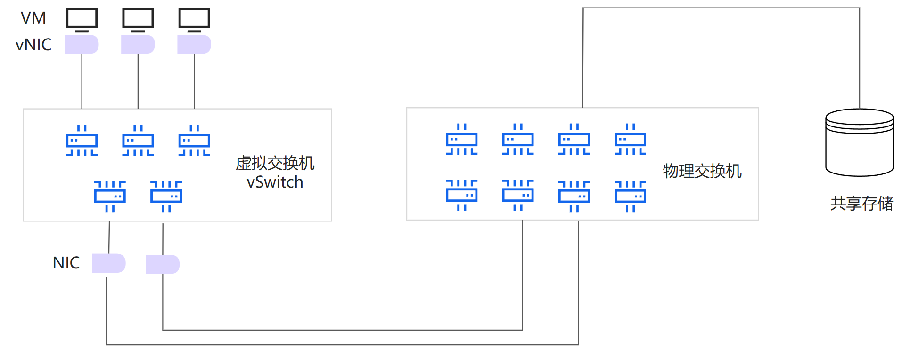
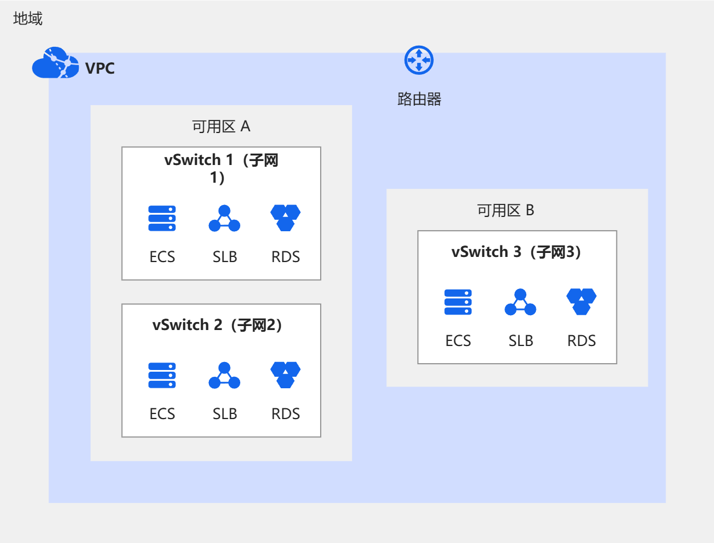

# vSwitch

vSwitch（Virtual Switch，虚拟交换机）是一种在虚拟化环境中使用的网络交换设备，它模拟了物理交换机的功能，使虚拟机（VMs）之间以及虚拟机与物理网络之间可以进行通信。vSwitch是虚拟化基础架构的关键组成部分，作为虚拟网络的核心组件存在于主机系统上。

## **为什么需要**vSwitch**？**

vSwitch对于构建和维护一个高效、安全和可管理的虚拟化数据中心网络环境至关重要。

- 网络隔离与安全性

  vSwitch可以创建多个独立的虚拟网络，这样可以将不同虚拟机组织在不同的网络中，从而实现网络隔离，避免数据泄露，并提高系统的安全性。

- 资源共享与优化

  通过vSwitch，不同虚拟机能够共享宿主机的物理网络接口，实现更高效的网络资源使用，并减少硬件成本。

- 灵活的网络配置

  通过vSwitch，管理员可以灵活配置网络设置，如VLAN（虚拟局域网）配置、安全策略、流量整形等，以适应不断变化的网络需求。

- 方便的网络管理

  在虚拟化环境中，vSwitch简化了网络管理任务，因为管理员可以从一个中心点管理所有的虚拟网络，无须物理地接触每个交换机。

- 扩展性

  随着企业的成长和虚拟化需求的增加，vSwitch可以轻松地进行扩展，以支持更多的虚拟机和复杂的网络拓扑。

## vSwitch的工作原理是什么？

vSwitch与传统物理交换机的连接方式相似，它允许虚拟机通过虚拟网络适配器与物理网络建立连接。vSwitch与物理网络接口（NIC）相连，从而接入物理网络。vSwitch能够识别连接在其虚拟端口上的虚拟机，并将网络流量有效地转发到这些虚拟机。在数据包达到最终目标前，vSwitch对其进行检查，以确保网络数据的正确传输。

### **网络桥接**

vSwitch工作在数据链路层（OSI模型的第二层），类似于物理交换机，负责在宿主机内部虚拟机之间传递以太网帧。vSwitch将宿主机的物理网络接口（NIC）桥接到虚拟网络接口（vNIC），使得虚拟机能够像连接到物理网络一样进行通信。

### **虚拟端口**

vSwitch为每台连接的虚拟机分配虚拟端口，这些虚拟端口对应虚拟机中的虚拟网络接口（vNIC）。vSwitch通过这些虚拟端口将数据包交换到正确的目的地，无论是在同一宿主机的其他虚拟机还是通过物理网络到达外部网络

### **VLAN与网络隔离**

为了在同一宿主机上的虚拟机之间提供网络隔离，vSwitch支持虚拟局域网络（VLAN）技术。通过VLAN，vSwitch可以将网络通信细分到不同的逻辑分区，无论这些虚拟机是否共享相同的物理硬件。

### **策略实施**

vSwitch可以实施各种网络策略，比如安全规则、访问控制列表（ACLs）、QoS（服务质量）等。vSwitch可以根据管理员的配置，限制或优先处理某些类型的流量，以满足特定的网络需求或保障安全。

### **流量监控**

vSwitch提供了监视和分析虚拟网络流量的能力。它可以进行端口镜像，将流经特定虚拟端口的所有数据包复制到另一个端口进行检查，以帮助网络监控和诊断问题。

## vSwitch有哪些实际应用

vSwitch的实际应用广泛，在企业和数据中心的虚拟化环境中发挥着关键作用。以下是vSwitch的几个典型应用：

- 数据中心网络虚拟化

  在数据中心内，vSwitch用于虚拟化网络基础设施，提供虚拟机之间的连通性，以及虚拟机与外界的通信。通过vSwitch，不同虚拟机可以在同一物理服务器上运行，同时相互隔离，确保不同客户或应用间的安全性。

- 多租户环境

  云服务提供商使用vSwitch在其基础设施中创建多租户网络，确保各个租户的网络流量相互独立。这对于维护服务质量和合规性非常重要，特别是在提供公共云服务时。

- 软件定义网络（SDN）

  在软件定义网络的架构中，vSwitch充当数据平面组件，用于转发流量。它们可以由中心化的控制器动态配置，从而实现高度灵活和可编程的网络设计。

- 开发和测试环境

  vSwitch使开发者和测试人员能够快速配置和模拟复杂的网络环境，而无需物理网络硬件，从而加快了应用程序的开发周期。

- 灾难恢复与业务连续性

  在灾难恢复计划中，vSwitch可以帮助实现快速的网络重构。如果主数据中心发生故障，vSwitch能够帮助迅速将网络流量切换到备用的数据中心，以此来保持业务运行和服务的连续性。

## **vSwitch和VPC是什么关系？**

[专有网络VPC](https://www.aliyun.com/getting-started/what-is/what-is-vpc)是您独有的云上虚拟网络，您可以将云资源部署在您自定义的专有网络的vSwitch（子网）中。虚拟交换机vSwitch是组成专有网络VPC的基础网络设备，为VPC内的云资源提供网络隔离和连接，创建VPC时必须至少创建一个vSwitch。VPC是地域级别的资源，不可以跨地域，但包含所属地域的所有可用区。您可以在每个可用区内创建一个或多个vSwitch来划分子网。下图展示了VPC和vSwitch之间的关系。

>一个VPC内划分多个子网的目的是部署不同安全级别或功能区域的云资源，增强网络管理的灵活性、安全性和效率。一个VPC内的所有子网默认私网互通。

## **阿里云如何满足您的vSwitch需求？**

### 相关产品

[专有网络VPC](https://www.aliyun.com/product/vpc)是用户基于阿里云创建的自定义私有网络, 不同的专有网络之间二层逻辑隔离。用户可以在自己定义的专有网络中使用阿里云资源，例如云服务器ECS、负载均衡SLB、云数据库RDS等，也可以在一个专有网络中创建多个交换机来划分子网。一个专有网络内的子网默认私网互通。

### **最佳实践**

- [资源使用者在共享交换机中创建云资源](https://help.aliyun.com/zh/vpc/user-guide/create-cloud-resources-in-shared-vswitch-as-principal)：VPC的所有者账号（资源所有者）可以将VPC内的非默认交换机共享给其他阿里云账号（主账号），其他阿里云账号（主账号）可以在共享的交换机内创建云资源。本文为您介绍资源使用者如何在共享交换机中创建云资源以及如何查看共享交换机。
- [管理共享交换机和使用者](https://help.aliyun.com/zh/vpc/user-guide/manage-shared-switches-and-consumers)：资源所有者可以在共享单元中管理共享交换机和共享交换机的使用者。本文为您介绍如何添加、查看、删除共享交换机以及共享交换机的使用者。
- [限制不同交换机下的ECS间的互通](https://help.aliyun.com/zh/vpc/user-guide/manage-intercommunication-among-ecs-instances-connected-to-different-vswitches)：通过网络ACL功能限制不同交换机下ECS实例的互通。
- [限制本地数据中心与云上的互通](https://help.aliyun.com/zh/vpc/user-guide/manage-communication-between-a-data-center-and-a-vpc)：通过网络ACL功能限制本地数据中心与云上的互通关系。
- [使用资源目录和共享VPC实现多账号网络互通](https://help.aliyun.com/zh/vpc/use-cases/use-resource-directories-and-shared-vpcs-to-implement-multi-account-network-interworking)：企业可以使用资源目录RD（Resource Directory）将多账号有序组织和管理，然后通过共享VPC快速实现多账号间的网络互通，确保业务部门可以聚焦自身业务需求，从而提升整个组织的IT效率。