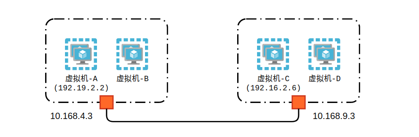
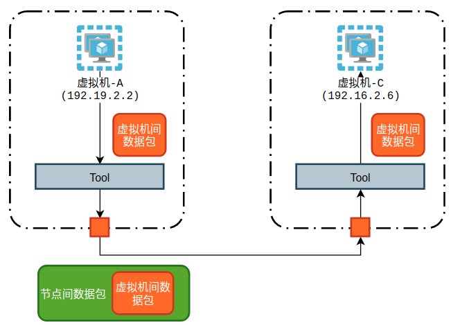
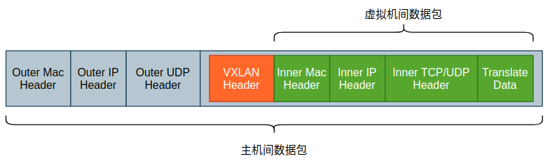
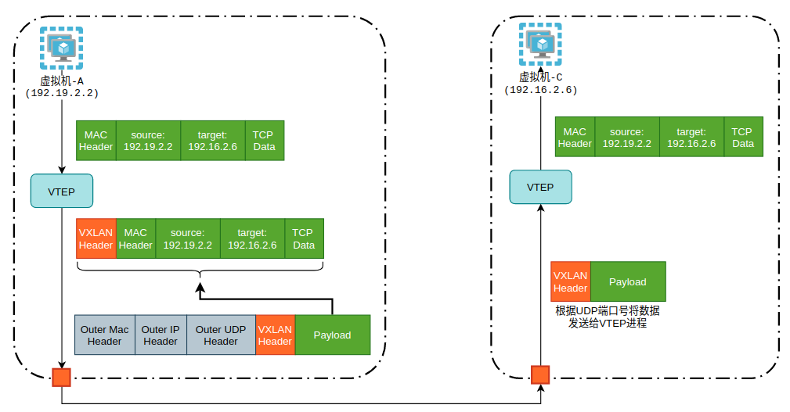

# VXLAN—构建Overlay容器网络


由于 VLAN 实现中的 VLAN ID 仅有12位，只能划分4096个虚拟局域网网段，对于云计算等领域而言，其用户远远不止4096个。并且，VLAN 依赖于交换机等物理设备的实现，一旦升级物理设备，集群网络可能需要重新配置。因此，基于上述的限制，VMware、Cisco 等大型网络企业推出了 VXLAN 解决方案。

VXLAN 全称为 Virtual eXtensible Local Area Network，可拓展虚拟局域网，不依赖于硬件实现，而是在三层网络(网络层)的基础之上构建出一个虚拟的二层网络(链路层)。也就是说，只要主机间 IP 地址可达，就可以使用 VXLAN 的方式构建一个 Overlay 网络。

>*Overlay: 可以理解为覆盖网络，属于一种虚拟网络的实现，依赖于物理网络，而物理网络又可称之为 Underlay。*



在实际的介绍 VXLAN 之前，先来看一个集群中虚拟机通讯的问题。如上图所示，虚拟机-A(`192.19.2.2`)想要和虚拟机-C(`192.16.2.6`)进行通信，要如何实现?

由于节点`10.168.4.3`和`10.168.9.3`能够实现通信，那么是否能够将虚拟机间通讯的数据包封装在节点间的通讯包之上，抵达目的地之后再进行解包、分发呢? 就好像特洛伊木马一样。



如上图所示，虚拟机-A发送给虚拟机-C的数据包，首先经过一个工具进行封包，暂且称之为Tool，封包的结果就是将该数据包放置在节点间通讯数据包的 Body 中，作为数据发送给节点B。节点B收到该数据包之后，经过某种过滤规则，检查 Body，发现这是一个发送给虚拟机-C的数据包，那么将数据包发送给节点C，单向通讯完成。

上述的过程其实就是 VXLAN 的基本原理组成，本质上就是对虚拟机间通讯数据包的封装和解封，乘着节点间通讯这条大船抵达目的地。


## 1. VXLAN协议原理

在 VXLAN 协议中，负责封包、解包的组件称之为 VTEP(VXLAN Tunnel Endpoints，VXLAN 隧道端点)，可以简单的认为就是运行在各个节点上的一个进程。

每一个 VTEP 都有一个唯一的标志符，称之为 VNI(VXLAN Network Identifier，VXLAN 网络标识符)，其实就是拓展的 VLAN ID。VNI 被设计成24位，可以容纳16777216个不同的虚拟局域网，相较于 VLAN 是一个非常大的提升。

VXLAN 在节点中的传输协议选择了 UDP 协议，而不是 TCP 协议。原因在于 UDP 协议相较于 TCP 协议速度更快，无需连接的建立与拆除，数据包的可靠传输则由虚拟机间的传输协议保证。



其中，VXLAN Header 由 VTEP 添加，其中包含了24位 VNI 的值。可以看到，VXLAN 其实就是对原有网络添加了一层拓展: VTEP。当数据包到达主机时，内核将 MAC 头和 IP 头取下，将 UDP 报文段发送给主机上的 VTEP 进程，VTEP 进程首先检查 VNI 的值是否匹配(是不是给自己的包)，然后根据 Inner IP Header 决定发送给哪一个具体的虚拟机。



现在，我们对 VXLAN 协议的基本原理已经很清楚了，现在再来看一些细节问题。**首先，虚拟机-A发出的数据帧的目标 MAC 地址，也就是目标 VTEP 的 MAC 地址该如何获取?** 两种方式，一种是通过广播的方式，另外一种，则是由外部进程自动的添加至各节点的 ARP 表中。**其次，IP 地址为192.16.2.6这台虚拟机所在节点的IP地址如何获取?** 该 IP 地址则是通过 Linux 内核中的 FDB(Forwarding Database) 获取的，在该表中，会记录 VTEP 的 MAC 地址与节点 IP 地址的映射关系，该映射关系同样可以通过广播学习获取，或者由外部进程维护。

>*经典的”外部进程”有 flannel、Weave 等容器网络框架*


## 2. 使用 Vagrant 构建 VXLAN 点对点通信

Vagrant 环境如下:

- node-1: 网卡接口-enp0s8，IP地址-192.168.2.15/24
- node-2: 网卡接口-enp0s8，IP地址-192.168.2.16/24

首先，在node-1上添加 vxlan interface:

```
vagrant@node-1:~$ sudo ip link add vxlan0 type vxlan \
    id 1024 \
    dstport 4789 \
    remote 192.168.2.15 \
    dev enp0s8
```

上述命令将创建出一个名称为`vxlan0`、类型为 vxlan 的网络接口，并且指定 VNI 为`1024`，vtep 通信端口为`4789`，并且手动地指出了对端 VTEP 的 IP 地址(`192.168.2.16`)。

其次，为 vxlan0 网络接口添加一个 IP 地址，该 IP 地址可以是任意值:

```
vagrant@node-1:~$ sudo ip addr add 10.100.1.15/24 dev vxlan0
vagrant@node-1:~$ sudo ip link set vxlan0 up
```

那么此时所有目标地址为`10.100.1.10/24`网段的数据包均会通过 vxlan0 接口处理，可以从路由表上查看此信息:

```
vagrant@node-1:~$ ip route
10.100.1.0/24 dev vxlan0 proto kernel scope link src 10.100.1.15
```

并且，如果此时查看 Linux FDB 表的话会发现，此时表项中的 MAC 地址为空值:

```
vagrant@node-1:~$ bridge fdb
00:00:00:00:00:00 dev vxlan0 dst 192.168.2.16 via enp0s8 self permanent
```

即所有经过 vxlan0 处理的数据包都会发到`192.168.2.16`，其原因在于在创建 vxlan0 时，手动地指定了对端 IP 地址。

用同样的方式在另一台虚拟机上创建 vxlan0 接口，并配置相应的 IP 地址，即可测试连通性。

通过上面的实验用例，我们可以看到几个非常关键的步骤:

- **在路由表中添加 vtep 设备网络段的路由信息**
- **在 ARP 表中添加 vtep 设备的 MAC 地址与 vtep 的 IP 地址映射**
- **在 FDB 表中添加 vtep 设备的 MAC 地址与 vtep 所在节点的 IP 地址映射**

实际上，`Flannel`这一经典的 Kubernetes 容器网络解决方案的 VXLAN 模式就是这么实现的，VXLAN 模式所组建的覆盖网络，其实就是一个由不同宿主机上的 VTEP 设备所组成的虚拟二层网络。


## Reference

- https://www.kernel.org/doc/Documentation/networking/vxlan.txt
- https://support.huawei.com/enterprise/zh/doc/EDOC1100087027