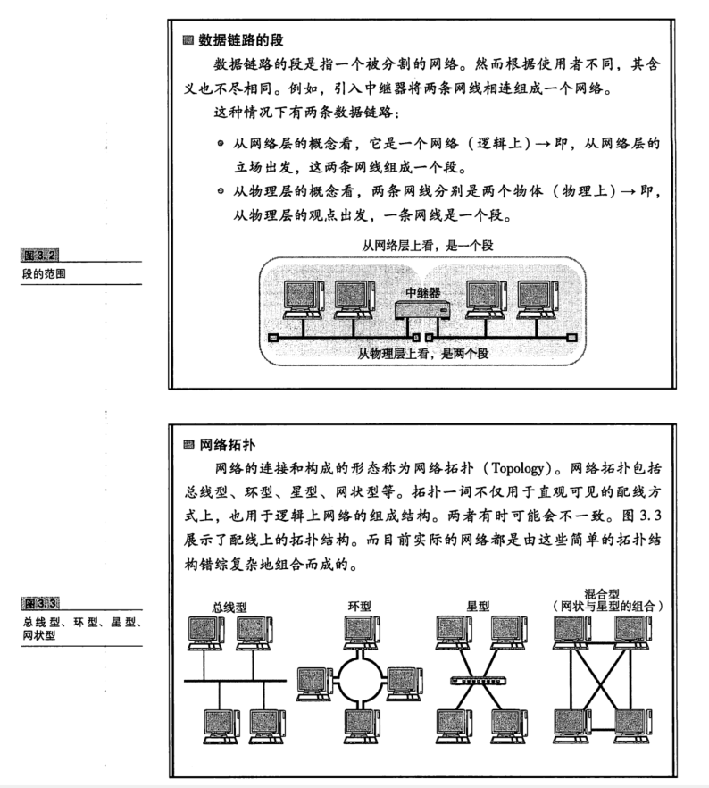
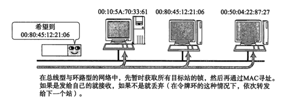
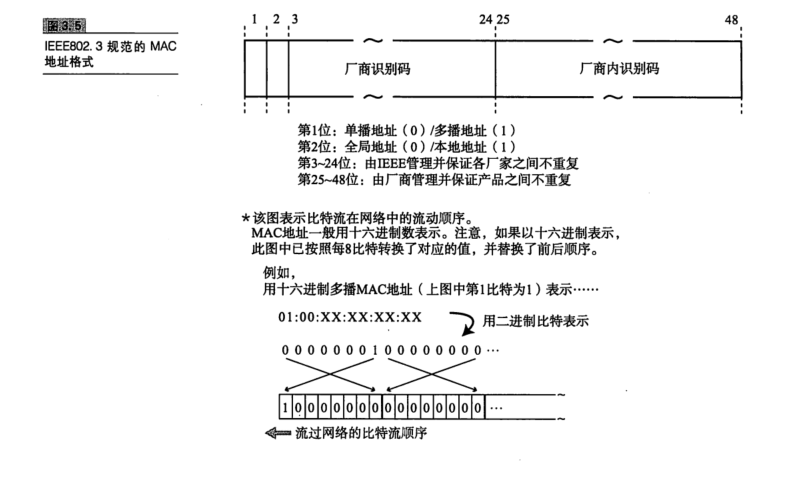

# 数据链路

## 数据链路的作用

数据链路，指 OSI参考模型中的数据链路层，有时也指以太网、无线局域网等通信手段。

TCP/IP 中对于 0SI参考模型的数据链路层及以下部分(物理层)未作定义。因为 TCP/IP 以这两层的功能是透明的为前提。然而，数据链路的知识对于深人理解 TCP/IP 与网络起着至关重要的作用。

 数据链路层的协议定义了通过通信媒介互连的设备之间传输的规范。通信媒介包括双绞线电缆、同轴电缆、光纤、电波以及红外线等介质。此外，各个设备之间有时也会通过交换机、网桥、中继器等中转数据。

实际上，各个设备之间在数据传输时，数据链路层和物理层都是必不可少的。众所周知，计算机以二进制0、1来表示信息，然而实际的通信媒介之间处理的却是电压的高低、光的闪灭以及电波的强弱等信号。把这些信号与二进制的0、1进行转换正是物理层(参考附录3)的责任。数据链路层处理的数据也不是单纯的
0、1序列，该层把它们集合为一个叫做“帧”的块，然后再进行传输。

本章旨在介绍 0SI参考模型中数据链路层的相关技术，包括MAC寻址(物理寻址)、介质共享、非公有网络、分组交换、环路检测、VLAN(Virtual Local Area Network，虚拟局域网)等。本章也会涉及作为传输方式的数据链路，如以太网、WLAN(Wireless Local Area Network,无限局域网)、PPP(Point to Point Protocol, 点对点协议)等概念。数据链路也可以被视为网络传输中的最小单位。其实，仔细观察连通全世界的互联网就可以发现，它也不外乎是由众多这样的数据链路组成的，因此又可以称互联网为“数据链路的集合”。

## 数据链路相关技术

### MAC 地址

MAC地址用于识别数据链路中互连的节点(如图3.4)。以太网或FDDI中，根据IEEE802.3的规范使用MAC地址。其他诸如无线LAN(IEEE802.1la/b/g/n等)、蓝牙等设备中也是用相同规格的 MAC 地址。

MAC地址长48比特，结构如图3.5所示。在使用网卡(NIC)的情况下MAC地址一般会被烧入到ROM中。因此，任何一个网卡的MAC地址都是唯一的，在全世界都不会有重复。

MAC地址中3~24位(比特位)表示厂商识别码，每个NIC厂商都有特定唯一的识别数字。25~48 位是厂商内部为识别每个网卡而用。因此，可以保证全世界不会有相同 MAC 地址的网卡。

### 根据 MAC 地址转发

在使用同轴电缆的以太网(10BASE5、10BASE2)等介质共享网络中，同一时间只能有一台主机发送数据。当连网的主机数量增加时，通信性能会明显下降。若将集线器或集中器等设备以星型连接，就出现了一款新的网络设备--交换集线器，这是一种将非介质共享型网络中所使用的交换机用在以太网中的技术，交换集线器也叫做以太网交换机。

以太网交换机就是持有多个端口"的网桥。它们根据数据链路层中每个帧的目标 MAC 地址，决定从哪个网络接口发送数据。这时所参考的、用以记录发送接口的表就叫做转发表(Forwarding Table)。

由于 MAC 地址没有层次性"，转发表中的入口个数与整个数据链路中所有网络设备的数量有关。当设备数量增加时，转发表也会随之变大，检索转发表所用的时间也就越来越长。当连接多个终端时，有必要将网络分成多个数据链路，采用类似于网络层的 IP 地址一样对地址进行分层管理。
