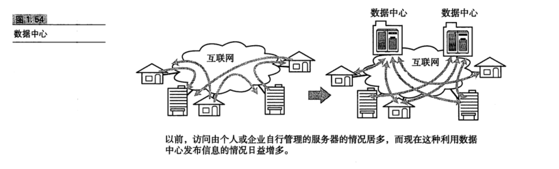

# 网络基础知识

## 网络的构成要素

### 通信媒介与数据链路

计算机网络是指计算机与计算机相连而组成的网络。那么现实当中计算机之间又是怎样连接的呢?
计算机之间通过电缆相互连接。电缆可以分为很多种，包括双绞线电缆、光纤电缆、同轴电缆、串行电缆等。根据数据链路"的不同选用的电缆类型也不尽相同。而媒介本身也可以被划分为电波、微波等不同类型的电磁波。表1.4总结了各种不同的数据链路、通信媒介及其标准传输速率。

### 网卡

任何一台计算机连接网络时，必须要使用网卡(全称为网络接口卡)。网络接口卡(NIC)有时也被叫做网络适配器、网卡、LAN卡。最近，很多产品目录中都加入了“内置LAN端口”的参数，说明越来越多的计算机在出厂设置中就具备了以太网(Etheret)1000BASE-T或100BASE-TX的端口"。没有配置 NIC 的计算机如果想接入以太网，至少得外接一个扩展以便插入NIC。无线局域网的情况下也是如此，计算机必须具备能够接人无线网的
NIC才能保证连接到网络。笔记本电脑如果没有内置的NIC，可以通过ExpressCard"或 CardBus、压缩闪存以及 USB 方式插一块 NIC 以后再连网。

### 中继器

中继器(Repeater)是在0SI模型的第1层--物理层面上延长网络的设备。由电缆传过来的电信号或光信号经由中继器的波形调整和放大再传给另一个电缆。

### 网桥/2 层交换机

网桥是在 OSI模型的第2层--数据链路层面上连接两个网络的设备。它能够识别数据链路层中的数据帧，并将这些数据帧临时存储于内存，再重新生成信号作为一个全新的帧转发给相连的另一个网段"。由于能够存储这些数据帧，网桥能够连接10BASE-T与100BASE-TX等传输速率完全不同的数据链路，并且不限制连接网段的个数。

### 路由器/3 层交换机

路由器是在 OSI模型的第3层--网络层面上连接两个网络、并对分组报文进行转发的设备。网桥是根据物理地址(MAC地址)进行处理，而路由器/3层交换机则是根据IP地址进行处理的。由此，TCP/IP中网络层的地址就成为了IP地址。
路由器可以连接不同的数据链路。例如连接两个以太网，或者连接一个以太网与一个 FDDI。现在，人们在家或办公室里连接互联网时所使用的宽带路由器也是路由器的一种。

路由器还有分担网络负荷的作用"，甚至有些路由器具备一定的网络安全功能。因此，在连接网络与网络的设备当中，路由器起着极为重要的作用。

### 4 ~7 层交换机

4~7层交换机负责处理 0SI模型中从传输层至应用层的数据。如果用TCP/IP分层模型来表述"，4~7层交换机就是以 TCP 等协议的传输层及其上面的应用层为基础，分析收发数据，并对其进行特定的处理。

例如，对于并发访问量非常大的一个企业级 Web站点"，使用一台服务器不足以满足前端的访问需求，这时通常会架设多台服务器来分担。这些服务器前端访问的入口地址通常只有一个(企业为了使用者的方便，只会向最终用户开放一个统一的访问 URL)。为了能通过同一个URL将前端访问分发到后台多个服务器上，可以在这些服务器的前端加一个负载均衡器。这种负载均衡器就是4~7 层交换机的一种"。

### 网关

此外，在使用wwW(World Wide Web，万维网)时，为了控制网络流量以及出于安全的考虑，有时会使用代理服务器(ProxyServer)。这种代理服务器也是网关的一种，称为应用网关。有了代理服务器，客户端与服务器之间无需在网络层上直接通信，而是从传输层到应用层对数据和访问进行各种控制和处理。防火墙就是一款通过网关通信，针对不同应用提高安全性的产品。

## 现代网络实态

### 网络的构成

### 互联网通信

人们在家里或公司连接互联网时，一般会使用互联网接人服务。联网之后，汇集到无线局域网路由器和最近交换机的通信会再次被连接到前面所提到的“接人层”"。甚至还有可能通过“边缘网络”或“主干网”实现与目标地址之间的通信。

### 从信息发布者的角度看网络

数据中心由大型服务器、存储以及计算机网络构成。有些大型的数据中心甚至直接连接“主干网”。即使是小规模的数据中心，大多数情况下也会连接到“边缘网络”。
数据中心内部的网络中分布着3层交换机和高速路由器。为了减少网络延迟也有人正在研究高性能2层交换机的使用。

