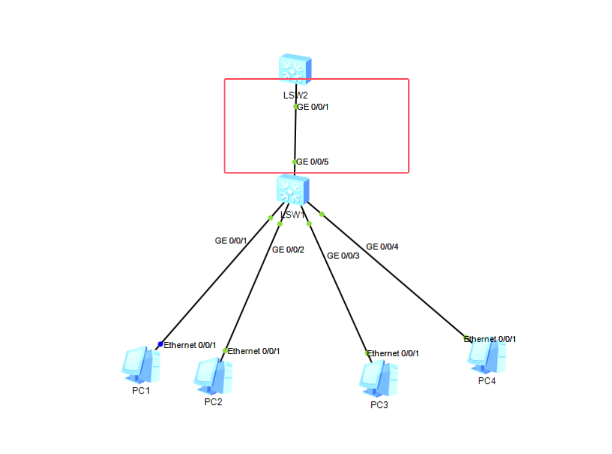
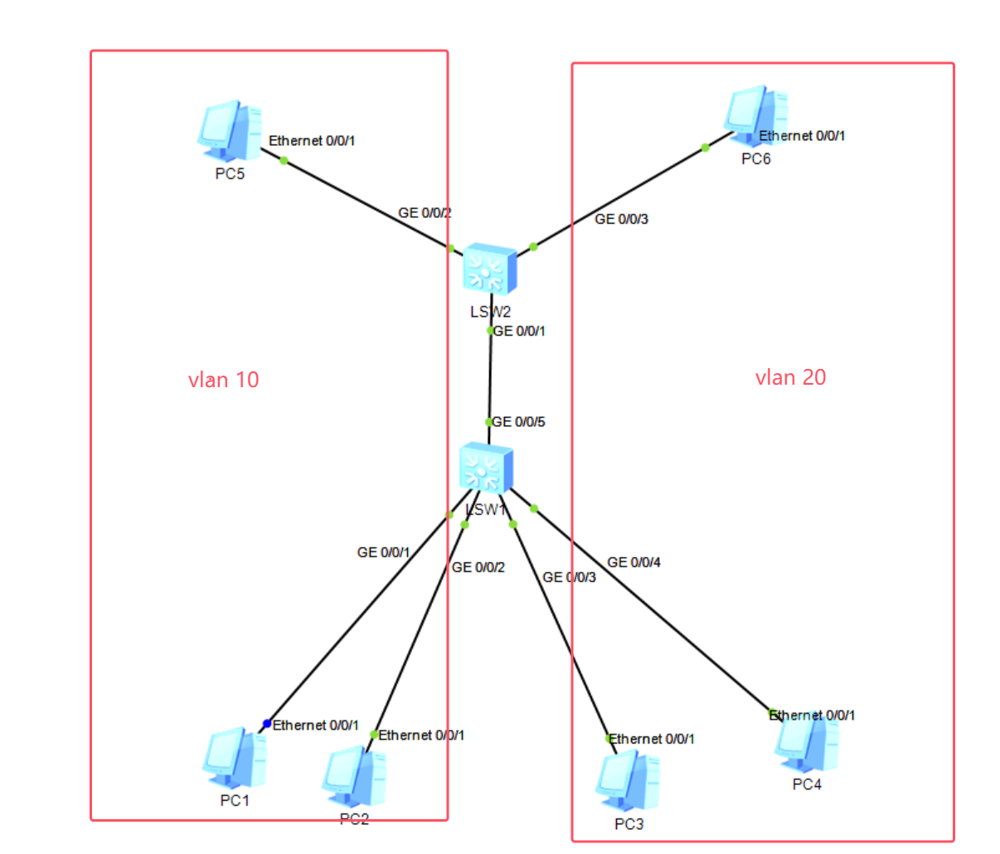
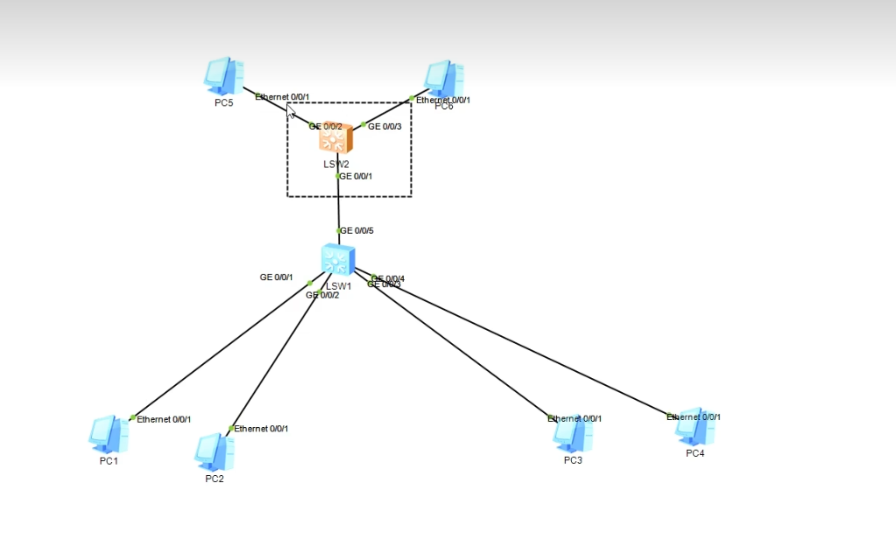

# 交换机


## 交换机外观结构


### S5700-28C-SI


​										**图1S5700-28C-SI外观**


[FAQ-S5700-SI交换机外观结构](https://support.huawei.com/enterprise/en/knowledge/KB1000067489)


#### 一般命名格式

```shell
GigabitEthernet 0/0/x  
```

其中：

- **GigabitEthernet**（简称 `GE`）：表示千兆以太网端口（10/100/1000M）
- **0**：表示设备的槽位号（对于固定端口交换机，槽位号通常是 `0`）
- **0**：子槽位号，固定端口一般也是 `0`
- **x**：端口编号，范围通常是 `1` 到 `20`（对应这 20 个电口）


#### **示例**

- **第 1 个千兆电口** → `GigabitEthernet 0/0/1`
- **第 10 个千兆电口** → `GigabitEthernet 0/0/10`
- **第 20 个千兆电口** → `GigabitEthernet 0/0/20`

如果是 **Combo 口（电口+光口）**，则通常也遵循类似格式，但会在接口描述中注明是 **Combo** 口，例如：

```
swift复制编辑GigabitEthernet 0/0/21  （Combo 口）  
GigabitEthernet 0/0/22  （Combo 口）  
GigabitEthernet 0/0/23  （Combo 口）  
GigabitEthernet 0/0/24  （Combo 口）  
```

> **注意**：
> 在华为交换机上，可以使用 `display interface brief` 命令查看端口状态和编号。

```shell
<Huawei>display interface brief
PHY: Physical
*down: administratively down
(l): loopback
(s): spoofing
(b): BFD down
(e): ETHOAM down
(dl): DLDP down
(d): Dampening Suppressed
InUti/OutUti: input utility/output utility
Interface                   PHY   Protocol InUti OutUti   inErrors  outErrors
GigabitEthernet0/0/1        up    up          0%     0%          0          0
GigabitEthernet0/0/2        up    up          0%     0%          0          0
GigabitEthernet0/0/3        up    up          0%     0%          0          0
GigabitEthernet0/0/4        down  down        0%     0%          0          0
GigabitEthernet0/0/5        down  down        0%     0%          0          0
GigabitEthernet0/0/6        down  down        0%     0%          0          0
GigabitEthernet0/0/7        down  down        0%     0%          0          0
GigabitEthernet0/0/8        down  down        0%     0%          0          0
GigabitEthernet0/0/9        down  down        0%     0%          0          0
GigabitEthernet0/0/10       down  down        0%     0%          0          0
GigabitEthernet0/0/11       down  down        0%     0%          0          0
GigabitEthernet0/0/12       down  down        0%     0%          0          0
GigabitEthernet0/0/13       down  down        0%     0%          0          0
GigabitEthernet0/0/14       down  down        0%     0%          0          0
GigabitEthernet0/0/15       down  down        0%     0%          0          0
GigabitEthernet0/0/16       down  down        0%     0%          0          0
GigabitEthernet0/0/17       down  down        0%     0%          0          0
GigabitEthernet0/0/18       down  down        0%     0%          0          0
GigabitEthernet0/0/19       down  down        0%     0%          0          0
GigabitEthernet0/0/20       down  down        0%     0%          0          0
GigabitEthernet0/0/21       down  down        0%     0%          0          0
GigabitEthernet0/0/22       down  down        0%     0%          0          0
GigabitEthernet0/0/23       down  down        0%     0%          0          0
GigabitEthernet0/0/24       down  down        0%     0%          0          0
```


## 交换机MAC 地址表

`dis mac-address` 命令用于 **显示设备的 MAC 地址表**，即交换机学习到的 MAC 地址信息，包括 VLAN、端口、MAC 地址类型等。


### **输出字段解析**

| 字段                      | 含义                                             |
| ------------------------- | ------------------------------------------------ |
| **MAC Address**           | 设备学习到的 MAC 地址                            |
| **VLAN/VSI/SI**           | VLAN ID（或 VSI/SI 标识）                        |
| **PEVLAN CEVLAN**         | 双 VLAN 透传相关，普通交换机场景一般为 `-`       |
| **Port**                  | 该 MAC 地址对应的物理端口                        |
| **Type**                  | MAC 地址的类型（动态 `dynamic` 或静态 `static`） |
| **LSP/LSR-ID MAC-Tunnel** | MPLS 相关信息，普通交换机场景一般为 `0/-`        |


### 示例

```shell
MAC address table of slot 0:
-------------------------------------------------------------------------------
MAC Address    VLAN/       PEVLAN CEVLAN Port            Type      LSP/LSR-ID  
               VSI/SI                                              MAC-Tunnel  
-------------------------------------------------------------------------------
5489-98a7-129f 1           -      -      GE0/0/1         dynamic   0/-         
5489-9882-6edd 1           -      -      GE0/0/2         dynamic   0/-         
-------------------------------------------------------------------------------
Total matching items on slot 0 displayed = 2  
```


当交换机的某个接口，收到一个数据包，这个数据包有源mac地址，把数据包的源mac地址和接收端口做对应，更新mac地址表。

1. **MAC 地址 `5489-98a7-129f`**
   - 处于 **VLAN 1**（默认 VLAN）
   - 通过 **端口 `GE0/0/1`** 学习到
   - 类型是 **动态（dynamic）**，表示是交换机自动学习的 MAC 地址
2. **MAC 地址 `5489-9882-6edd`**
   - 处于 **VLAN 1**
   - 通过 **端口 `GE0/0/2`** 学习到
   - 类型是 **动态（dynamic）**

**总结**

- **交换机端口 `GE0/0/1` 和 `GE0/0/2` 分别连接了 MAC 地址为 `5489-98a7-129f` 和 `5489-9882-6edd` 的设备**
- **MAC 地址是动态学习的**，说明这些设备最近在网络中通信过
- **VLAN ID 为 1**，这两个 MAC 地址都属于 VLAN 1（默认 VLAN）

>通过数据包的目标Mac地址，我们就知道数据包从交换机哪个接口发出去，这样就可以把包转发到目的地。


## ARP协议


>**pc1**(1.1.1.1)给**pc2**(1.1.1.2)发包的时候（例如ping），怎么知道**pc2**的**Mac**地址是**54-89-98-82-6E-DD**？

通过arp协议（地址解析协议），pc1通过广播的形式，发出一个arp询问（1.1.1.2的Mac地址是？），既然是广播，它就会发给同一个广播域的所有设备，广播包所有设备都能收到，pc2收到就会Mac地址**54-89-98-82-6E-DD**回给pc1。

抓包数据


## vlan（虚拟局域网）

上面的示例会存在一些问题，比如当电脑多的时候，有大量的广播包，导致网络卡顿。

使用vlan技术，可以把一个大的局域网分割成多个小的局域网，就会起到分割广播域的功能。这样的话1台电脑所发的广播包只会在小的局域网内活动。


### 配置vlan


我们把**pc1**和**pc2**放在一个vlan, **pc3**和**pc4**放在一个vlan

**创建vlan**

先进入系统视图模式,system-view

```
[Huawei-vlan10]vlan 10
[Huawei-vlan10]vlan 20
```

这样就创建了两个vlan。

然后我们把GE 0/0/1、GE 0/0/2 这两个接口放进vlan 10， 把GE 0/0/3、GE 0/0/4 放进vlan 20

```shell
[Huawei-vlan20]int g0/0/1
[Huawei-GigabitEthernet0/0/1]port link-type access
```

>接口类型有两种，一种是access,一种是trunk。
>
>如果一个接口只用连接一个vlan，用access就行了，如果一个接口要连接多个vlan,就得用trunk。
>
>如下图交换机LSW2 GE 0/0/1 接口既要接收vlan 10，又要接收 vlan 20,就得把接口类型设置为trunk


把接口设置为 vlan 10

```shell
[Huawei-GigabitEthernet0/0/1]port default vlan 10
```

查看

```shell
[Huawei-GigabitEthernet0/0/1]dis this
#
interface GigabitEthernet0/0/1
 port link-type access
 port default vlan 10
#
```

同理GE 0/0/2做一模一样的操作。

```shell
[Huawei-GigabitEthernet0/0/1]int g0/0/2
[Huawei-GigabitEthernet0/0/2]port link-type access
[Huawei-GigabitEthernet0/0/2]port default vlan 10
```


查看vlan配置

```shell
[Huawei-GigabitEthernet0/0/2]q
[Huawei]
[Huawei]
[Huawei]dis vlan
The total number of vlans is : 3
--------------------------------------------------------------------------------
U: Up;         D: Down;         TG: Tagged;         UT: Untagged;
MP: Vlan-mapping;               ST: Vlan-stacking;
#: ProtocolTransparent-vlan;    *: Management-vlan;
--------------------------------------------------------------------------------

VID  Type    Ports                                                          
--------------------------------------------------------------------------------
1    common  UT:GE0/0/3(U)      GE0/0/4(U)      GE0/0/5(D)      GE0/0/6(D)      
                GE0/0/7(D)      GE0/0/8(D)      GE0/0/9(D)      GE0/0/10(D)     
                GE0/0/11(D)     GE0/0/12(D)     GE0/0/13(D)     GE0/0/14(D)     
                GE0/0/15(D)     GE0/0/16(D)     GE0/0/17(D)     GE0/0/18(D)     
                GE0/0/19(D)     GE0/0/20(D)     GE0/0/21(D)     GE0/0/22(D)     
                GE0/0/23(D)     GE0/0/24(D)                                     

10   common  UT:GE0/0/1(U)      GE0/0/2(U)                                      

20   common  

VID  Status  Property      MAC-LRN Statistics Description      
--------------------------------------------------------------------------------

1    enable  default       enable  disable    VLAN 0001                         
10   enable  default       enable  disable    VLAN 0010                         
20   enable  default       enable  disable    VLAN 0020                         
[Huawei]
```


GE 0/0/3、GE 0/0/4同理。

```
[Huawei]int g0/0/3
[Huawei-GigabitEthernet0/0/3]port link-type access
[Huawei-GigabitEthernet0/0/3]port default vlan 20

[Huawei-GigabitEthernet0/0/3]int g0/0/4
[Huawei-GigabitEthernet0/0/4]port link-type access
[Huawei-GigabitEthernet0/0/4]port default vlan 20
```


### 测试网络隔离

```shell
PC>ping 1.1.1.2

Ping 1.1.1.2: 32 data bytes, Press Ctrl_C to break
From 1.1.1.2: bytes=32 seq=1 ttl=128 time=31 ms
From 1.1.1.2: bytes=32 seq=2 ttl=128 time=47 ms
From 1.1.1.2: bytes=32 seq=3 ttl=128 time=32 ms
From 1.1.1.2: bytes=32 seq=4 ttl=128 time=31 ms
From 1.1.1.2: bytes=32 seq=5 ttl=128 time=47 ms

--- 1.1.1.2 ping statistics ---
  5 packet(s) transmitted
  5 packet(s) received
  0.00% packet loss
  round-trip min/avg/max = 31/37/47 ms

PC>
PC>ping 1.1.1.3

Ping 1.1.1.3: 32 data bytes, Press Ctrl_C to break
From 1.1.1.1: Destination host unreachable
From 1.1.1.1: Destination host unreachable
From 1.1.1.1: Destination host unreachable
From 1.1.1.1: Destination host unreachable
From 1.1.1.1: Destination host unreachable

--- 1.1.1.3 ping statistics ---
  5 packet(s) transmitted
  0 packet(s) received
  100.00% packet loss
```


### trunk



```
[Huawei]int g0/0/5
[Huawei-GigabitEthernet0/0/5]port link-type trunk
[Huawei-GigabitEthernet0/0/5]port trunk allow-pass vlan 10 20
```


查看

```shell
[Huawei-GigabitEthernet0/0/5]dis this
#
interface GigabitEthernet0/0/5
 port link-type trunk    // 接口类型设置为trunk
 port trunk allow-pass vlan 10 20   // 接口允许 vlan 10 和 20 通过
#
```


LSW2 GE 0/0/1 配置

```shell
[Huawei]int g0/0/1
[Huawei-GigabitEthernet0/0/1]port link-type trunk
[Huawei-GigabitEthernet0/0/1]port trunk allow-pass vlan 10 20
```


#### 配置




LSW2 创建vlan

```shell
[Huawei-vlan10]vlan 10
[Huawei-vlan10]vlan 20
```

这样就创建了两个vlan。

然后我们把GE 0/0/2、GE 0/0/3 这两个接口分别放进vlan 10、 vlan 20

```shell
[Huawei-vlan20]int g0/0/2
[Huawei-GigabitEthernet0/0/2]port link-type access
[Huawei-GigabitEthernet0/0/2]port de vlan 10

[Huawei-GigabitEthernet0/0/2]int g0/0/3
[Huawei-GigabitEthernet0/0/3]port link-type access
[Huawei-GigabitEthernet0/0/3]port de vlan 20
```


查看配置

```shell
[Huawei]dis vlan
The total number of vlans is : 3
--------------------------------------------------------------------------------
U: Up;         D: Down;         TG: Tagged;         UT: Untagged;
MP: Vlan-mapping;               ST: Vlan-stacking;
#: ProtocolTransparent-vlan;    *: Management-vlan;
--------------------------------------------------------------------------------

VID  Type    Ports                                                          
--------------------------------------------------------------------------------
1    common  UT:GE0/0/1(U)      GE0/0/4(D)      GE0/0/5(D)      GE0/0/6(D)      
                GE0/0/7(D)      GE0/0/8(D)      GE0/0/9(D)      GE0/0/10(D)     
                GE0/0/11(D)     GE0/0/12(D)     GE0/0/13(D)     GE0/0/14(D)     
                GE0/0/15(D)     GE0/0/16(D)     GE0/0/17(D)     GE0/0/18(D)     
                GE0/0/19(D)     GE0/0/20(D)     GE0/0/21(D)     GE0/0/22(D)     
                GE0/0/23(D)     GE0/0/24(D)                                     

10   common  UT:GE0/0/2(U)                                                      

             TG:GE0/0/1(U)                                                      

20   common  UT:GE0/0/3(U)                                                      

             TG:GE0/0/1(U)                                                      


VID  Status  Property      MAC-LRN Statistics Description      
--------------------------------------------------------------------------------

1    enable  default       enable  disable    VLAN 0001                         
10   enable  default       enable  disable    VLAN 0010                         
20   enable  default       enable  disable    VLAN 0020                         
```


#### ping 测试

pc1 ping pc5 可以正常ping 通

pc1 ping pc6 不可以ping 通

```shell
PC>ping 1.1.1.5

Ping 1.1.1.5: 32 data bytes, Press Ctrl_C to break
From 1.1.1.5: bytes=32 seq=1 ttl=128 time=78 ms
From 1.1.1.5: bytes=32 seq=2 ttl=128 time=63 ms
From 1.1.1.5: bytes=32 seq=3 ttl=128 time=78 ms
From 1.1.1.5: bytes=32 seq=4 ttl=128 time=78 ms
From 1.1.1.5: bytes=32 seq=5 ttl=128 time=63 ms

--- 1.1.1.5 ping statistics ---
  5 packet(s) transmitted
  5 packet(s) received
  0.00% packet loss
  round-trip min/avg/max = 63/72/78 ms

PC>
PC>
PC>
PC>ping 1.1.1.6

Ping 1.1.1.6: 32 data bytes, Press Ctrl_C to break
From 1.1.1.1: Destination host unreachable
From 1.1.1.1: Destination host unreachable
From 1.1.1.1: Destination host unreachable
From 1.1.1.1: Destination host unreachable
From 1.1.1.1: Destination host unreachable

--- 1.1.1.6 ping statistics ---
  5 packet(s) transmitted
  0 packet(s) received
  100.00% packet loss

```

测试成功。


#### vlan tag



上面测试的时候LSW2怎么知道pc1 和 pc 2是 vlan 10还是 vlan 20，这里就涉及到 vlan tag 的概念，当数据包经过trunk 线路的时候，是携带vlan tag 的，就能告诉其他交换机，这个数据包是什么 vlan 的。


我们可以抓个包看一下

