# 路由协议

## 路由控制的定义

## 路由控制范围

随着 IP网络的发展，想要对所有网络统一管理是不可能的事。因此，人们根据路由控制的范围常使用IGP(Interior Gateway Protocol)和EGP(Exterior Gateway Protocol)两种类型的路由协议。

## 路由算法

路由控制有各种各样的算法，其中最具代表性的有两种，是距离向量（Distance-Vector）算法和链路状态(Link-State)算法。

### 距离向量算法

### 链路状态算法

### 主要路由协议

路由协议分很多种。表7.1列出了主要的几种路由协议。
其中，由于EGP不支持CIDR，现在已经不再用作互联网的对外连接协议了。在以后的章节中将详细介绍RIP、RIP2、OSPF、BGP等协议的基础知识。

>此处的 EGP 不是区分IGP与EGP 的那个EGP，而是指一种叫做 EGP 的特定的协议。

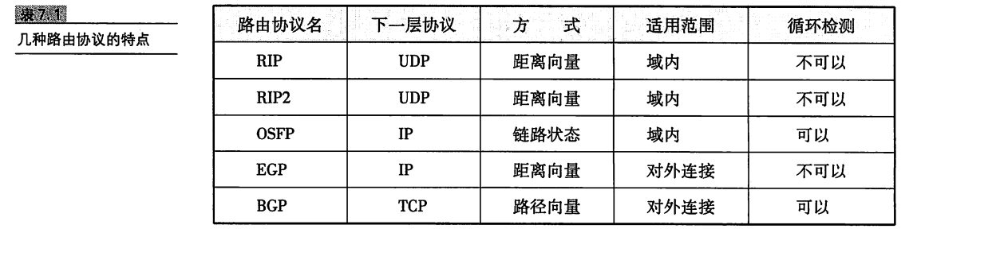

## RIP

RIP(Routing Information Protocol)是距离向量型的一种路由协议，广泛用于LAN。被 BSD UNIX作为标准而提供的routed采用了RIP，因此 RIP 得到了迅速的普及。

### 广播路由控制信息

RIP 将路由控制信息定期(30秒一次)向全网广播。如果没有收到路由控制信息，连接就会被断开。不过，这有可能是由于丢包导致的，因此RIP规定等待5次。如果等了6次(180秒)仍未收到路由信息，才会真正关闭连接。

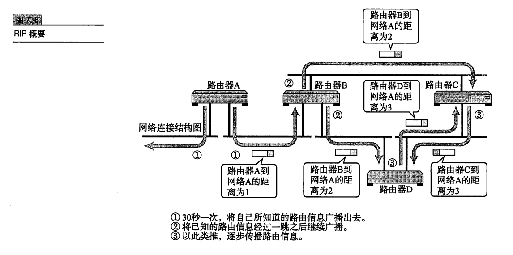

### 根据距离向量确定路由

RIP 基于距离向量算法决定路径。距离(Metrics)的单位为“跳数”。跳数是指所经过的路由器的个数。RIP希望尽可能少通过路由器将数据包转发到目标IP地址，如图7.7所示。根据距离向量生成距离向量表，再抽出较小的路由生成最终的路由控制表。

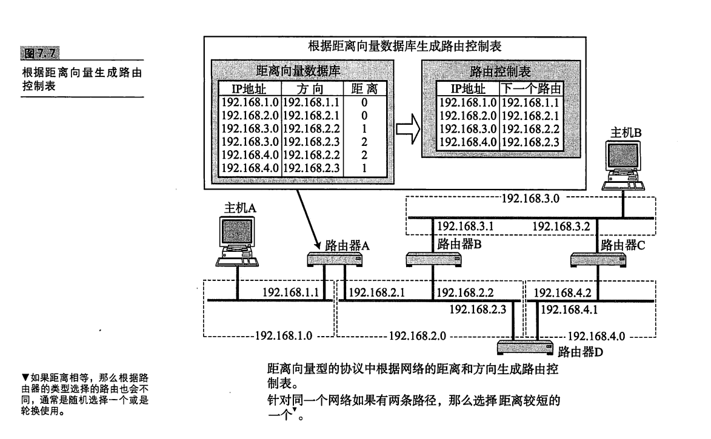

### 使用子网掩码时的 RIP 处理

RIP 虽然不交换子网掩码信息，但可以用于使用子网掩码的网络环境。不过

在这种情况下需要注意以下几点:

- 从接口的IP地址对应分类得出网络地址后，与根据路由控制信息流过此路由器的包中的 IP地址对应的分类得出的网络地址进行比较。如果两者的网络地址相同，那么就以接口的网络地址长度为准。
- 如果两者的网络地址不同，那么以IP地址的分类所确定的网络地址长度为准。

例如，路由器的接口地址为192.168.1.33/27。很显然，这是一个C类地址因此按照IP地址分类它的网络地址为192.168.1.33/24。与192.168.1.33/24相符合的IP地址，其网络地址长度都被视为27位。除此之外的地址，则采用每个地址的分类所确定的网络地址长度。

因此，采用RIP进行路由控制的范围内必须注意两点:一是，因IP地址的分类而产生不同的网络地址时;二是，构造网络地址长度不同的网络环境时。

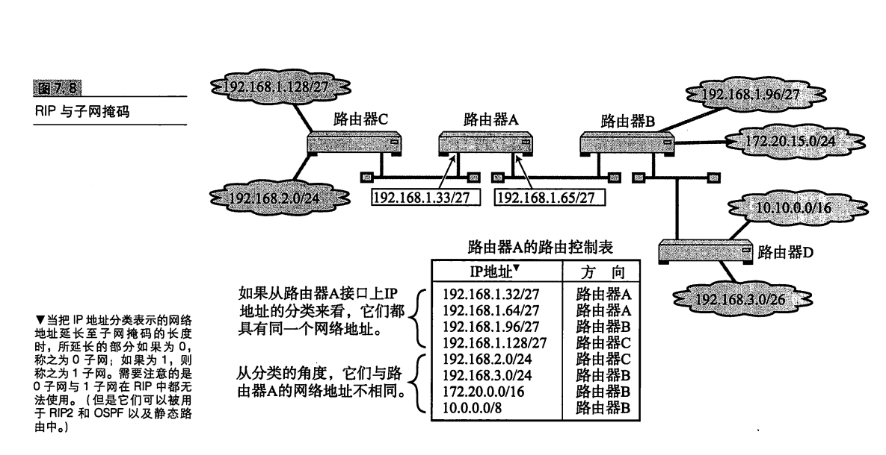

### RIP 中路由变更时的处理

todo

### RIP2

RIP2 的意思是 RIP第二版。它是在 RIP使用过程中总结了经验的基础上进行改良后的一种协议。第二版与第一版的工作机制基本相同，不过仍有如下几个新的特点。

- 使用多播

  RIP 中当路由器之间交换路由信息时采用广播的形式，然而在RIP2中改用了多播。这样不仅减少了网络的流量，还缩小了对无关主机的影响。

- 支持子网掩码

  与 OSPF类似的，RIP2支持在其交换的路由信息中加人子网掩码信息。

- 路由选择域

  与OSPF的区域类似，在同一个网络中可以使用逻辑上独立的多个RIP。

- 外部路由标志

  通常用于把从 BGP 等获得的路由控制信息通过 RIP传递给 AS内。

- 身份验证密钥

  与OSPF 一样，RIP包中携带密码。只有在自己能够识别这个密码时才接收数据，否则忽略这个 RIP 包。

## OSPF

OSPF(Open Shortest Path First)是根据OSI的IS-IS 协议而提出的一种链路状态型路由协议。由于采用链路状态类型，所以即使网络中有环路，也能够进行稳定的路由控制。
另外，OSPF支持子网掩码。由此，曾经在RIP中无法实现的可变长度子网构造的网络路由控制成为现实。

甚至为了减少网络流量，0SPF还引人了“区域”这一概念。区域是将一个自治网络划分为若干个更小的范围。由此，可以减少路由协议之间不必要的交换。
OSPF可以针对IP首部中的区分服务(TOS)字段，生成多个路由控制表。不过，也会出现已经实现了 OSPF功能的路由器无法支持这个TOS的情况。

### OSPF 是链路状态型路由协议

OSPF为链路状态型路由器。路由器之间交换链路状态生成网络拓扑信息，然后再根据这个拓扑信息生成路由控制表。

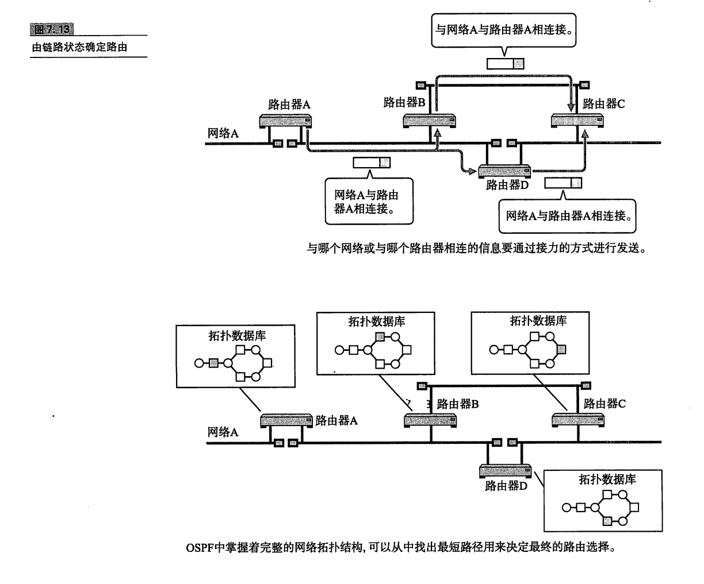

RIP的路由选择，要求途中所经过的路由器个数越少越好。与之相比，0SPF可以给每条链路"赋予一个权重(也可以叫做代价)，并始终选择一个权重最小的路径作为最终路由。也就是说OSPF以每个链路上的代价为度量标准，始终选择一个总的代价最小的一条路径。如图7.14对比所示，RIP是选择路由器个数最少的路径，而 OSPF是选择总的代价较小的路径。

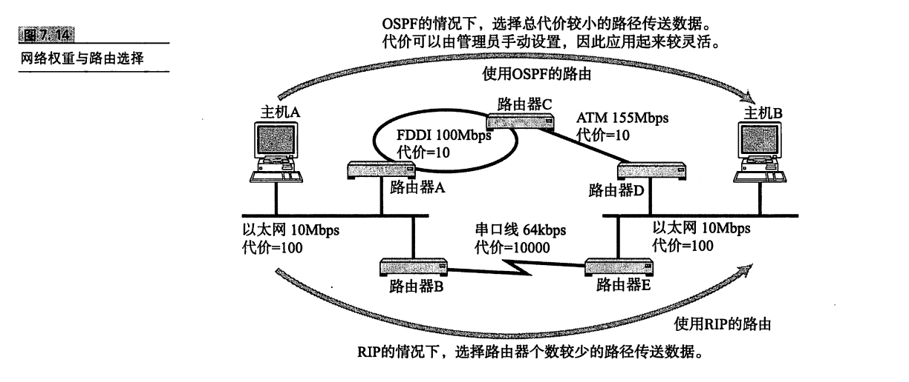

### OSPF 基础知识

在OSPF中，把连接到同一个链路的路由器称作相邻路由器(Neighboring Router)。在一个相对简单的网络结构中，例如每个路由器仅跟一个路由器相互连接时，相邻路由器之间可以交换路由信息。但是在一个比较复杂的网络中，例如在同一个链路中加入了以太网或FDDI等路由器时，就不需要在所有相邻的路由器之间都进行控制信息的交换，而是确定一个指定路由器(Designated Router)，并以它为中心交换路由信息即可。

RIP 中包的类型只有一种。它利用路由控制信息，一边确认是否连接了网络一边传送网络信息。但是这种方式，有一个严重的缺点。那就是，网络的个数越多，每次所要交换的路由控制信息就越大。而且当网络已经处于比较稳定的、没有什么变化的状态时，还是要定期交换相同的路由控制信息，这在一定程度上浪
费了网络带宽。而在 OSPF中，根据作用的不同可以分为5种类型的包。

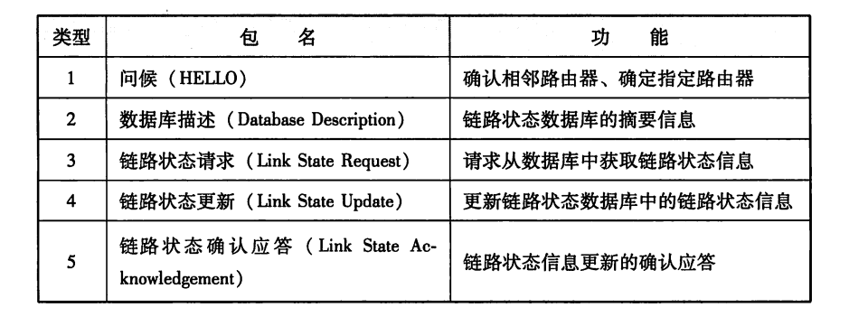

通过发送问候(HELLO)包确认是否连接。每个路由器为了同步路由控制信息，利用数据库描述(Database Description)包相互发送路由摘要信息和版本信息。如果版本比较老，则首先发出一个链路状态请求(LinkStateRequest)包请求路由控制信息，然后由链路状态更新(LinkState Update)包接收路由状态信息，最后再通过链路状态确认(LinkState ACKPacket)包通知大家本地已经接收到路由控制信息。有了这样一个机制以后，OSPF不仅可以大大地减少网络流量，还可以达到迅速更新路由信息的目的。

### OSPF工作原理概述

OSPF 中进行连接确认的协议叫做 HELLO 协议。

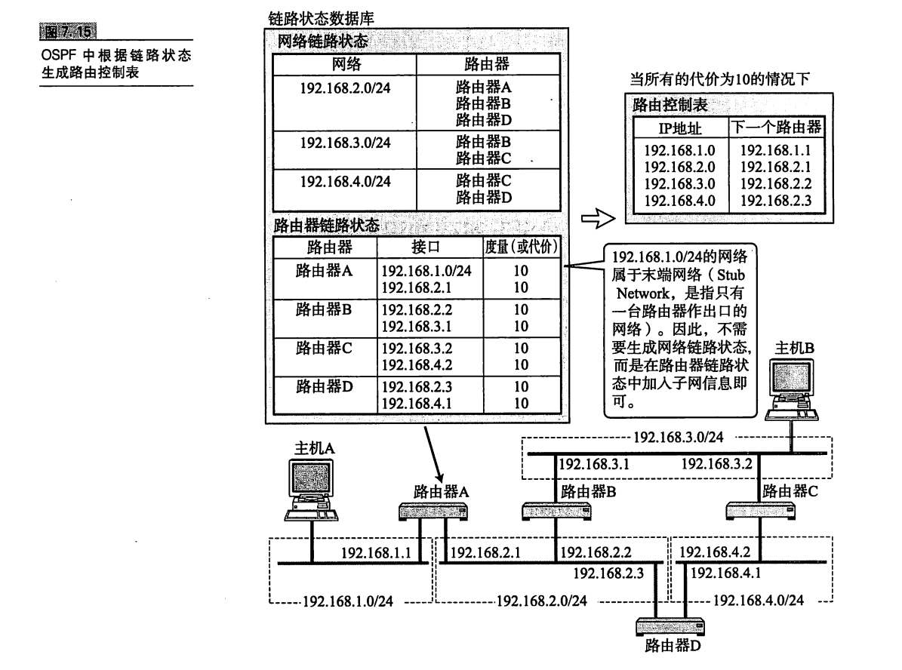

LAN 中每10秒发送一个 HELLO包。如果没有 HELLO 包到达，则进行连接是否断开的判断"。具体为，允许空等3次，直到第4次(40秒后)仍无任何反馈就认为连接已经断开。之后在进行连接断开或恢复连接操作时，由于链路状态发生了变化，路由器会发送一个链路状态更新包(LinkState Update Packet)通知其他路由器网络状态的变化。链路状态更新包所要传达的消息大致分为两类:一是网络LSA，另一个是路由器 LSA。

相比距离向量，由上述过程所生成的路由控制表更加清晰不容易混淆，还可以有效地降低无线循环问题的发生。不过，当网络规模逐渐越大时，最短路径优先算法的处理时间就会变得越长，对 CPU和内存的消耗也就越大。

### 将区域分层化进行细分管理

链路状态型路由协议的潜在问题在于，当网络规模越来越大时，表示链路状态的拓扑数据库就变得越来越大，路由控制信息的计算也就越困难。0SPF为了减少计算负荷，引入了区域的概念。
区域是指将连接在一起的网络和主机划分成小组，使一个自治系统(AS)内可以拥有多个区域。不过具有多个区域的自治系统必须要有一个主干区域(Backbone Area)，并且所有其他区域必须都与这个主于区域相连接。

连接区域与主干区域的路由器称作区域边界路由器;而区域内部的路由器叫做内部路由器;只与主干区域内连接的路由器叫做主干路由器;与外部相连接的路由器就是AS边界路由器。

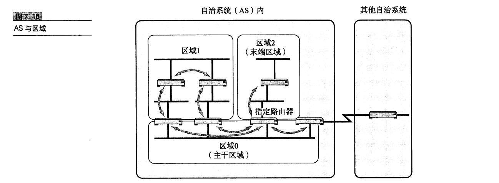

每个区域内的路由器都持有本区域网络拓扑的数据库。然而，关于区域之外的路径信息，只能从区域边界路由器那里获知它们的距离。区域边界路由器也不会将区域内的链路状态信息全部原样发送给其他区域，只会发送自己到达这些路由器的距离信息，内部路由器所持有的网络拓扑数据库就会明显变小。

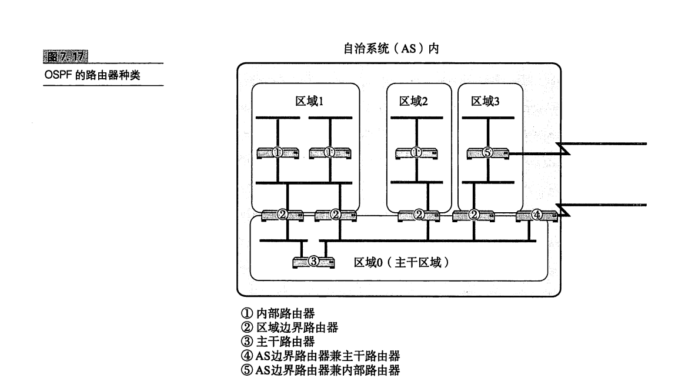

换句话，就是指内部路由器只了解区域内部的链路状态信息，并在该信息的基础上计算出路由控制表。这种机制不仅可以有效地减少路由控制信息，还能减轻处理的负担。

## BGP

BGP(Border GatewayProtocol)，边界网关协议是连接不同组织机构(或者说连接不同自治系统)的一种协议。因此，它属于外部网关协议(EGP)。具体划分，它主要用于ISP 之间相连接的部分。只有BGP、RIP和OSPF共同进行路由控制，才能够进行整个互联网的路由控制。

### BGP与AS 号

在RIP和OSPF中利用IP的网络地址部分进行着路由控制，然而BCP则需要放眼整个互联网进行路由控制。BCP的最终路由控制表由网络地址和下一站的路由器组来表示，不过它会根据所要经过的 AS个数进行路由控制。

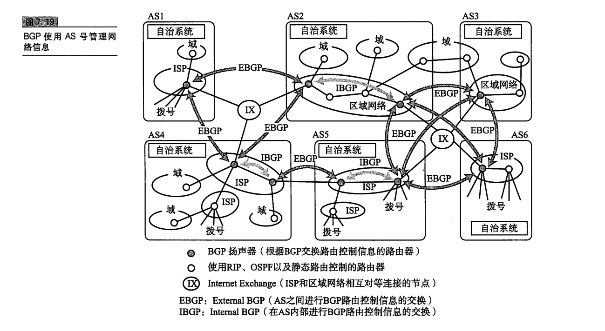

ISP、区域网络等会将每个网络域编配成一个个自治系统(AS:Autonomous System)进行管理。它们为每个自治系统分配一个16比特的AS编号。BGP 就是根据这个编号进行相应的路由控制。

### BGP 是路径向量协议

根据 BCP 交换路由控制信息的路由器叫做BGP扬声器。BGP扬声器为了在AS 之间交换 BGP 信息，必须与所有 AS 建立对等的 BGP 连接。此外，如图7.20中的自治系统 AS2、AS4、AS5，它们在同一个 AS内部有多个 BGP 扬声器。在这种情况下，为了使 AS 内部也可以交换 BGP 信息，就需要建立 BGP 连接。